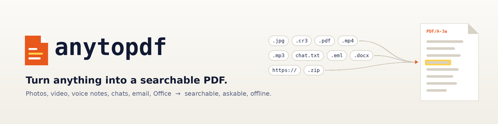
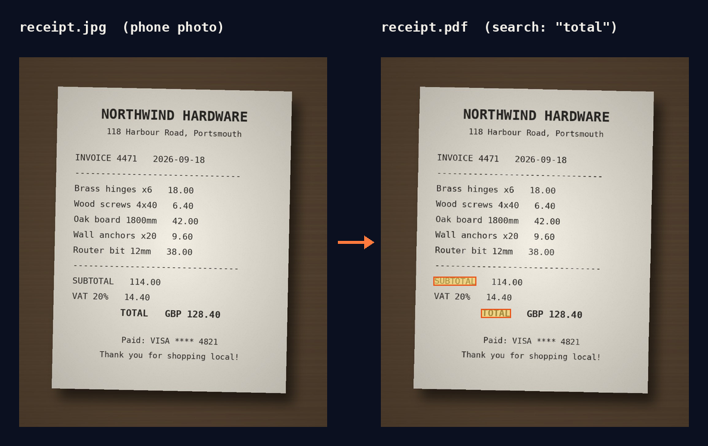

<p align="center">
  <picture>
    <source media="(prefers-color-scheme: dark)" srcset="docs/brand/banner-dark.png">
    
  </picture>
</p>

<p align="center">
  <a href="https://github.com/adeelahmad/anytopdf-rs/actions/workflows/ci.yml"></a>
  <a href="https://github.com/adeelahmad/anytopdf-rs/releases/latest"></a>
  <a href="#license"></a>
  
  
  <a href="#mcp-server"></a>
</p>

# anytopdf

**Turn photos, scans, video, audio, email, Office files and archives into one
searchable PDF, offline, with a single binary.**

```console
$ anytopdf receipt.jpg meeting.mp4 inbox.mbox -o evidence.pdf
```

Every page looks like the original. Underneath, an invisible text layer carries
the OCR, transcripts, captions and timestamps, so Ctrl+F, Spotlight, `pdftotext`
and your RAG pipeline all find the words. A manifest with SHA-256 hashes and
per-page chunks is embedded in the PDF, which makes the file its own index.

<p align="center">
  
</p>

<p align="center">
  
</p>

<sub>Both images come from a real run of the release binary
(`python3 docs/demo/record.py`); nothing is mocked.</sub>

## What it does

| | |
| --- | --- |
| **Reads almost anything** | Photos (JPEG, PNG, TIFF, HEIC/AVIF), scanned and digital PDFs, video, audio, SRT/VTT captions, text and Markdown, JSON and JSON Lines, HTML, `.eml`/`.mbox` email with attachments, Word/Excel/PowerPoint/OpenDocument, zip and tar archives, and print jobs |
| **Finds the words** | OCR through Apple Vision, docTR or Tesseract, kept word-aligned under the image; speech to text through the bundled Whisper plugin; video keyframes chosen by interval and scene change |
| **Writes a real archive file** | Tagged PDF/A-3a with bookmarks, Arabic/Hebrew/CJK shaping, byte-reproducible output, and a provenance page |
| **Proves where it came from** | Embedded `anytopdf-manifest.json` and `anytopdf-chunks.json` with source hashes and page maps; `anytopdf extract --json` reads them back |
| **Plugs into agents** | `anytopdf mcp` is a Model Context Protocol server: `claude mcp add anytopdf -- anytopdf mcp` |
| **Runs unattended** | Folder-backed job queue, HTTP upload intake, signed webhooks, an IMAP mailbox watcher, and an optional IPP printer helper that phones and laptops can print to |
| **Extends without forks** | Any `anytopdf-plugin-*` executable on `PATH`, in any language, speaks a versioned JSON protocol; an opt-in sandbox confines it |

Nothing leaves your machine: no cloud OCR, no telemetry, and no network access
unless you turn on an intake channel (queue server, webhooks, IMAP or the printer).

## Install

| Platform | Command |
| --- | --- |
| macOS, Linux | `curl -fsSL https://raw.githubusercontent.com/adeelahmad/anytopdf-rs/main/install.sh \| sh` |
| Homebrew | `brew tap adeelahmad/anytopdf https://github.com/adeelahmad/anytopdf-rs && brew install adeelahmad/anytopdf/anytopdf` |
| Windows (Scoop) | `scoop bucket add anytopdf https://github.com/adeelahmad/anytopdf-rs; scoop install anytopdf/anytopdf` |
| cargo-binstall | `cargo binstall --git https://github.com/adeelahmad/anytopdf-rs anytopdf` |
| Docker | `docker run --rm -v "$PWD:/work" ghcr.io/adeelahmad/anytopdf-rs photo.jpg -o photo.pdf` |
| From source | `cargo install --locked --git https://github.com/adeelahmad/anytopdf-rs anytopdf` |

Or download an archive for your platform from
[Releases](https://github.com/adeelahmad/anytopdf-rs/releases/latest). The
installer verifies the release's SHA-256 checksum before it installs anything.
Text and image conversion need nothing else; run `anytopdf doctor` to see which
optional providers (FFmpeg, Tesseract, ExifTool, Poppler, LibreOffice) it found.
Every channel is described in [docs/distribution.md](docs/distribution.md).

## Quick start

Install as above, or unpack the archive for your operating system and run `./anytopdf` (Windows:
`anytopdf.exe`). The executable needs no Rust or Python installation for text and
image conversion; provider-specific dependencies are listed below.

```bash
./anytopdf --version
./anytopdf notes.txt photo.jpg -o out.pdf
./anytopdf --no-plugins convert notes.txt --ocr off -o notes.pdf
./anytopdf doctor
```

Keep `Cargo.lock` when building from source. For video, install FFmpeg; for OCR,
use native Apple Vision on macOS or install Tesseract. Audio transcription requires
a supplied transcript or a plugin.

Office documents (`.docx`, `.xlsx`, `.pptx`, `.odt`, `.ods`, `.odp`, `.rtf` and
their legacy formats) need LibreOffice (`soffice`) and Poppler's `pdftoppm`.
Each page is rendered as an image; with Poppler's `pdftotext` the document's own
text is placed invisibly over it and OCR is skipped for those pages. Without
`pdftotext`, pages fall back to OCR. The conversion runs in the job workspace with
a private LibreOffice profile, so the original file is never opened in place.

### Whisper transcription

`anytopdf-plugin-whisper` transcribes audio and video sources that have no
sidecar or `--transcript` transcript. It extracts the audio with FFmpeg and runs
one of these engines, adding a visible, timed transcript page whose segments are
searchable `transcript` annotations:

- whisper.cpp (`whisper-cli`) with `ANYTOPDF_WHISPER_MODEL` set to a ggml model
  file, for example `ggml-base.en.bin`;
- `whisper-ctranslate2` (faster-whisper) or OpenAI `whisper`, with
  `ANYTOPDF_WHISPER_MODEL` naming the model (default `base`).

Release archives ship the plugin in a `plugins/` folder beside `anytopdf`, and
Homebrew installs it under `$(brew --prefix anytopdf)/libexec/plugins`. It stays
off until `ANYTOPDF_PLUGIN_PATH` names that folder, so media conversions without
a Whisper engine do not warn. The container image has a `WHISPER=cpp` build that
includes whisper.cpp and enables it (see [docs/distribution.md](docs/distribution.md)).
From source:

```bash
cargo build --release -p anytopdf-plugin-whisper
export ANYTOPDF_PLUGIN_PATH="$PWD/target/release"
export ANYTOPDF_WHISPER_MODEL="$HOME/models/ggml-base.en.bin"
anytopdf convert meeting.mp4 --plugin-timeout 1800 -o meeting.pdf
```

`ANYTOPDF_WHISPER_ENGINE` (`auto`, `whisper.cpp`, `openai-whisper`),
`ANYTOPDF_WHISPER_BIN` (an engine executable not on `PATH`) and
`ANYTOPDF_WHISPER_LANGUAGE` (default: detect) override the defaults. One plugin
invocation transcribes every media source in the job, so raise
`--plugin-timeout` (default 60 seconds) for long recordings. A missing engine,
missing FFmpeg or a source without an audio track becomes a `plugin.warning`;
the PDF is still written.

### Visual descriptions

`anytopdf-plugin-vlm` asks a local vision-language model about every image and
video keyframe and writes the answers as searchable `caption` annotations. By
default it asks for a caption, "What do you see in this image?" and the
activities shown, as the original video-analysis script did. For each video,
audio file or subtitle file it then adds a visible summary page before the
source's other pages, with a category and up to five topics (`custom`
annotations whose `entity` is `category` or `topic`). Videos also get a one- or
two-sentence summary per scene (keyframes are split at FFmpeg scene changes).
Summaries are written from the keyframe descriptions plus any transcript or
subtitles; audio needs a transcript, for example from the Whisper plugin. Prompts
never ask for anyone's age, gender, ethnicity or emotions.

The plugin does nothing until `ANYTOPDF_VLM_URL` is set. It talks to either:

- an OpenAI-compatible endpoint (default `ANYTOPDF_VLM_ENGINE=openai`): Ollama,
  llama.cpp `llama-server`, LM Studio or vLLM, with `ANYTOPDF_VLM_MODEL` naming
  a vision model; or
- the Moondream API (`ANYTOPDF_VLM_ENGINE=moondream`): Moondream Station, or
  Moondream2 through transformers with the bundled
  `helpers/anytopdf-moondream-server.py` (`--device cpu|cuda`). This engine also
  supports open-vocabulary detection: `ANYTOPDF_VLM_DETECT="red car,logo"` adds
  an `object` annotation with a box for each match.

```bash
ollama pull llava
cargo build --release -p anytopdf-plugin-vlm
export ANYTOPDF_PLUGIN_PATH="$PWD/target/release"
export ANYTOPDF_VLM_URL=http://127.0.0.1:11434/v1 ANYTOPDF_VLM_MODEL=llava
anytopdf convert meeting.mp4 --plugin-timeout 120 -o meeting.pdf
```

| Variable | Default | Meaning |
| --- | --- | --- |
| `ANYTOPDF_VLM_PROMPTS` | caption, query, activity | `type=prompt` entries separated by `\|`; an entry without `type=` is a `query` |
| `ANYTOPDF_VLM_TIMEOUT` | `50` | seconds per keyframe, and for all summaries of a run; keep it below `--plugin-timeout` |
| `ANYTOPDF_VLM_MAX_SIDE` | `768` | images are downscaled to this many pixels before upload |
| `ANYTOPDF_VLM_API_KEY` | none | bearer token (OpenAI) or `X-Moondream-Auth` (Moondream) |
| `ANYTOPDF_VLM_SUMMARY` | `on` | `off` skips summaries and categories |
| `ANYTOPDF_LLM_URL`, `ANYTOPDF_LLM_MODEL` | the VLM endpoint | OpenAI-compatible text model for summaries; required for them with the Moondream engine |
| `ANYTOPDF_VLM_CATEGORIES` | news, entertainment, education, sports, music, gaming, tutorial, meeting, documentary, other | comma-separated category list |

Images go to the configured endpoint, so point it at a server you trust; a
loopback URL bypasses any HTTP proxy. `--plugin-sandbox strict` blocks network
access and therefore this plugin. An unreachable endpoint, a slow frame or a bad
answer becomes a `plugin.warning`, and the PDF is still written.

## How it works

`anytopdf` is a pluggable media/document ingestion engine whose canonical output
is a searchable, RAG-friendly PDF.

It is deliberately not implemented as "a list of file extensions plus converters".
The architecture is closer to a driver framework:

```
sources
  -> discover/probe
  -> importer
  -> asset graph
  -> source enrichers
  -> unit enrichers
  -> page planner
  -> renderer
  -> searchable PDF
```

A source may produce any number of derived units. A video can produce keyframes,
audio segments, subtitle cues and metadata. An image generally produces one visual
unit. A transcript produces text units. Future importers can produce whatever
representation makes sense for formats such as `.igl`, CAD, email, Office,
archives, proprietary exports, or remote sources.

## Search model

Every fact becomes an `Annotation` with provenance:

- OCR text and bounding boxes
- captions / closed captions
- transcript text and time ranges
- file / EXIF / XMP / ffprobe metadata
- date/time and GPS/location metadata
- scene/keyframe changes
- object labels from an object-analysis plugin
- neutral face presence/count/bounds from a face-analysis plugin
- arbitrary future annotations

The PDF renderer paints the visual page normally and emits searchable annotations
as invisible text (fill opacity 0 in the default `pdfa` renderer, text rendering
mode 3 in `pdf`). The hidden layer carries content only
(OCR, captions, transcripts, objects, barcodes, time ranges); source paths and file
metadata are never written into it. Text/transcript units become normal
visible text pages.

The built-in project intentionally limits face enrichment to neutral facts such
as presence, count and bounds. It does **not** infer gender identity, emotion,
age or other sensitive/demographic traits from a face. The plugin model supports
adding other non-sensitive semantic analyzers without changing the core.

## Plugin model

There are two kinds of plugins.

### 1. Built-in Rust plugins

These implement Rust traits and are compiled into the executable. This is what
you use for fast, portable core functionality.

### 2. Runtime executable plugins

Executables named `anytopdf-plugin-*` are discovered from `PATH` and directories
in `ANYTOPDF_PLUGIN_PATH` (using the platform path separator). They speak the versioned JSON protocol documented in
`PLUGIN_PROTOCOL.md`.

This is the compatibility boundary for future/proprietary formats. A runtime
plugin can be written in Rust, Go, Python, Swift, C++, etc.; there is no Rust
dynamic-library ABI dependency.

A future `.igl` plugin can therefore be shipped independently:

```
anytopdf-plugin-igl
```

and register itself as an importer without modifying the core binary.

## Current built-ins

Importers:
- raster images
- existing PDFs: pages rendered by Poppler `pdftoppm` with their own text layer kept (OCR only for textless pages); text only without Poppler
- HEIC/HEIF/AVIF photos, converted by `sips` (macOS), `heif-convert` (libheif) or ImageMagick
- PWG Raster and Apple Raster (URF) print jobs
- video through FFmpeg
- audio container placeholder units
- text / Markdown
- JSON and JSON Lines (`.json`, `.jsonl`, `.ndjson`, or sniffed): one searchable chunk per record with its key paths, API envelopes such as `{"data": [...]}` split into records, other documents as an indented outline
- HTML pages (readable text, title and image alt text; no network fetches)
- email (`.eml`, `.mbox`): headers and body as text; attachments imported by their own importers
- archives (`.zip`, `.tar`, `.tar.gz`/`.tgz`): an index page plus every member through its own importer, with zip-bomb and path-traversal limits
- SRT / VTT captions
- Office documents (Word, Excel, PowerPoint, OpenDocument, RTF) through
  LibreOffice and Poppler

Enrichment:
- ExifTool metadata
- ffprobe media metadata
- OCR provider chain:
  - Apple Vision on macOS when built with `apple-vision`
  - docTR through local Python when available
  - Tesseract CLI
- sidecar captions / transcripts
- video timestamps and scene-selection provenance

Rendering:
- tagged PDF/A-3a with bookmarks via `krilla` (default, `--renderer pdfa`)
- plain searchable PDF via `printpdf` (`--renderer pdf`)

Bundled runtime plugins (separate executables in this workspace):
- `anytopdf-plugin-whisper`: speech-to-text for audio and video through
  whisper.cpp or an OpenAI-compatible Whisper CLI
- `anytopdf-plugin-vlm`: keyframe captions, questions, activities, video and
  scene summaries and a category through a local vision-language model

External plugins are the intended route for model-heavy enrichers such as:
- YOLO / DETR object detection
- scene classification
- speech-to-text engines
- format-specific decoders
- proprietary document systems

## Printing to anytopdf

`helpers/anytopdf-printer` is an optional IPP Everywhere printer built on
[PAPPL](https://www.msweet.org/pappl/) for Linux and macOS. Anything that can print
(macOS, iOS, Windows, Android, CUPS) can print to it, and every job becomes a
searchable PDF in an output folder. It listens on localhost unless told otherwise:

```bash
make printer
ANYTOPDF_BIN=target/release/anytopdf \
  helpers/anytopdf-printer/anytopdf-printer server -o output-directory=$HOME/Printed
```

The helper only spools pages; `anytopdf convert` does the work, so a saved
`job.pwg` or `job.urf` print job converts the same way on any platform.

## CLI

```bash
anytopdf convert . -o archive.pdf
anytopdf convert photo.jpg meeting.mp4 transcript.srt -o searchable.pdf
anytopdf convert meeting.mp4 --transcript meeting.vtt -o meeting.pdf
anytopdf convert . --filter 'invoice|receipt' -o receipts.pdf

anytopdf doctor
anytopdf plugins
anytopdf probe some.igl
anytopdf extract archive.pdf --json
anytopdf capture screen --duration 60 -o screen.pdf
anytopdf mcp
```

Video defaults combine interval sampling and FFmpeg scene-change sampling and
then perceptually deduplicate frames.

```bash
anytopdf convert meeting.mp4 \
  --video-interval 5 \
  --scene-threshold 0.30 \
  -o meeting.pdf
```

### Screen capture

`anytopdf capture screen` records the screen with FFmpeg and converts the
recording like any video: a frame every `--interval` seconds plus every scene
change, with near-duplicates dropped, then OCR and the usual pipeline.

```bash
anytopdf capture screen -o session.pdf                  # until Ctrl-C
anytopdf capture screen --duration 600 --interval 10 -o standup.pdf
anytopdf capture screen --display 1 --keep-recording s.mkv -- --ocr tesseract
```

It uses FFmpeg's platform grabber: `avfoundation` on macOS, `gdigrab` (whole
desktop) or `ddagrab` (`--display N`) on Windows, `x11grab` on Linux. Pass
`--input-format` and `--input` for any other FFmpeg input, such as `kmsgrab` on a
Wayland session. macOS needs the Screen Recording permission for the terminal app;
`anytopdf doctor` reports it and the grabber under "Screen capture". Options after
`--` go to `convert`; the recording is deleted unless `--keep-recording` is given,
and the PDF defaults to `screen-<UTC time>.pdf`.

### Progress events

`anytopdf convert --events` writes one NDJSON object per line to stderr
(`anytopdf.events/1`, `schemas/events.schema.json`) instead of human progress and
`error:` lines. Every run ends with exactly one `run.finished` event whose
`status` (`ok`, `partial`, `failed`) and `exit_code` match the process exit code;
a failed run adds an `error` message. A closed stderr pipe never panics.

### PDF/A-3 output

`anytopdf convert` writes tagged PDF/A-3a by default (`--renderer pdfa`);
`--renderer pdf` writes plain PDF through printpdf instead. Pages, page numbering and
the embedded manifest and chunks are the same with both. On top of that, `pdfa`:

- Fonts are always embedded. The first `ANYTOPDF_FONT` entry is the primary font;
  without it the bundled DejaVu Sans (Latin, Greek, Cyrillic, Hebrew, basic Arabic) is
  used, so no system font is needed. `ANYTOPDF_FONT` may list more fonts, separated like `PATH`, and they
  are tried next, followed by common system fonts for Arabic, Hebrew and CJK. A
  fallback font is embedded only when it supplies characters the earlier fonts lack.
  Fonts whose licence forbids embedding are skipped. Characters no font covers are
  left out with a render warning, because PDF/A forbids `.notdef` glyphs.
- Each line is reordered with the Unicode bidi algorithm and shaped, so Arabic and
  Hebrew read correctly. Right-to-left lines carry `ActualText` with the logical
  order for copying and extraction.
- The structure tree has a section per unit, a figure with alternate text per image or
  frame, a paragraph per source line, and an H1 heading on the provenance page.
  Bookmarks point to the first page of each source and to the provenance page. The
  document language is `und` (undetermined).
- The document carries XMP metadata and an sRGB output intent. The manifest and
  chunks are PDF/A-3 associated files (`/AF`, relationship `Data`).
- The hidden layer is written as text with a fill opacity of 0 rather than text
  rendering mode 3, because krilla has no mode 3. It is still searchable and
  extractable.

Output is reproducible under `SOURCE_DATE_EPOCH`. Text the bundled font covers renders
the same on every host; fallback fonts for other scripts come from the host, so such
text can embed different fonts on different hosts.

### Embedded manifest and chunks

Every converted PDF embeds two JSON attachments: `anytopdf-manifest.json`
(`anytopdf.manifest/1`: sources with SHA-256 and size, units, providers, profile)
and `anytopdf-chunks.json` (`anytopdf.chunks/1`: one chunk per unit with page
traceability). Schemas live in `schemas/`. The `share` profile omits absolute
paths. If embedding fails, the same JSON is written beside the PDF as
`<output>.manifest.json` and `<output>.chunks.json` and an informational
`manifest.sidecar` notice is printed.

`anytopdf extract <pdf> --json` prints one `anytopdf.extract/1` document
(`schemas/extract.schema.json`) with `origin` (`embedded` or `sidecar`), the
`manifest`, the `chunks` and `warnings`. A manifest or chunks `schema_version`
other than the supported one adds an `extract.version-mismatch` warning (also
on stderr) but still exits 0. A version-matched manifest or chunks file that
does not match its schema exits 3 (input); the error names the document and the
first failing JSON path. A PDF with no embedded or sidecar manifest exits
3 (input).

### Watching a mailbox (IMAP)

`anytopdf watch imap` turns each new message in one mailbox into its own PDF
(release builds include it; source builds need the default `imap` feature):

```bash
export ANYTOPDF_IMAP_PASSWORD=...   # or --password-file; never a command-line flag
anytopdf watch imap --host imap.example.com --user scans@example.com \
  --allow-from example.com --output-dir ~/mail-pdfs -- --ocr auto --profile share
```

- Each message is fetched with `BODY.PEEK[]` (the mailbox is not modified unless
  `--mark-seen` or `--move-to <mailbox>` is given), saved as a raw `.eml`, and
  converted by a child `anytopdf convert` into
  `<output-dir>/<mailbox>-<uidvalidity>-<uid>.pdf`. Arguments after `--` go to
  convert. The child does not inherit `ANYTOPDF_IMAP_PASSWORD` or
  `ANYTOPDF_IMAP_OAUTH_TOKEN`. The built-in email importer renders each message
  (headers, body and attachments through the normal importers).
- `--queue <QUEUE>` instead of `--output-dir` hands each message to an
  `anytopdf queue` directory as a job (origin `imap`) carrying the options after
  `--`; run `anytopdf queue work <QUEUE>` to convert, with webhooks if wanted.
- `--allow-from` (repeatable) accepts an address (`scanner@example.com`) or a whole
  domain (`example.com`, no subdomains); mail from anyone else is skipped, left in
  the mailbox and not retried. The From header is easy to forge, so add
  `--require-dmarc <authserv-id>` (for example `mx.google.com` or `outlook.com`) to
  also require `dmarc=pass` in the `Authentication-Results` header your own mail
  server added; copies of that header further down the message are ignored.
- `--auth login` (default) sends IMAP `LOGIN` with a password or app password.
  `--auth xoauth2` signs in to Gmail or Microsoft 365 with an OAuth2 access token
  from `ANYTOPDF_IMAP_OAUTH_TOKEN` or `--oauth-token-file`. The file is read again
  on every connection, so a separate token refresher (for example a cron job using
  your OAuth client's refresh token) can replace it; anytopdf does not run a
  browser sign-in.
- Progress lives in `<state-dir>/state.json` (default `.anytopdf-imap` inside the
  output or queue directory), keyed by the mailbox's UIDVALIDITY. The first run
  only picks up mail that arrives afterwards; `--backfill` takes existing mail
  too. Failed conversions are retried on later checks up to `--max-attempts`, then
  the message is kept in `<state-dir>/failed`. Messages over `--max-message-bytes`
  are skipped. Delivery is at least once: a crash mid-conversion converts that
  message again.
- `--tls implicit` (default, port 993) or `--tls starttls` (port 143) use the
  operating system's trusted roots plus an optional `--ca-file`; `--tls none` is
  refused unless the host is loopback.
- The watcher waits with IMAP IDLE when the server supports it and otherwise polls
  every `--poll-interval` seconds; it reconnects with backoff after network errors.
  `--once` checks a single time and exits (for cron). Connection settings may also
  come from `ANYTOPDF_IMAP_HOST`, `_PORT`, `_TLS`, `_USER`, `_MAILBOX`, `_AUTH`,
  `_PASSWORD_FILE` and `_OAUTH_TOKEN_FILE`. Use one `--state-dir` per mailbox and
  one watcher per state directory.

### Job queue and webhooks

`anytopdf queue` runs conversions from a plain queue directory, so it needs no
database or daemon. Only `queue serve` listens on a port; the worker only makes outbound
requests when `--webhook` is given.

```bash
anytopdf queue add ~/scans-queue invoice.jpg -- --profile share
anytopdf queue work ~/scans-queue -- --ocr auto     # options for inbox files
anytopdf queue work ~/scans-queue --once            # drain, then exit
anytopdf queue status ~/scans-queue
```

- Files dropped into `QUEUE/inbox/` are claimed once two scans
  (`--poll-interval`, default 2 seconds) see the same size and mtime. Dotfiles and
  `*.part`, `*.tmp`, `*.crdownload`, `*.download` and `*.partial` names are ignored.
- Job records (`anytopdf.job/1`, `schemas/job.schema.json`) move between
  `QUEUE/jobs/pending`, `running`, `done` and `failed` by atomic rename, so several
  workers can share a queue. PDFs land in `QUEUE/outbox/`.
- Each job runs `anytopdf convert --events --json` as a child process;
  `QUEUE/work/<id>/events.ndjson` keeps its NDJSON events and `convert.json` its
  result. Convert options after `--` are checked by the convert parser; `-o`,
  `--output-dir`, `--events`, `--json` and `--dump-graph` belong to the worker.
- `--job-timeout` (default 3600 seconds) stops an overrunning conversion. A
  running job whose worker died is requeued once its lease (timeout plus 60
  seconds) expires.
- Runtime plugins in queued jobs run under `--plugin-sandbox contain` unless you
  pass another level (`anytopdf --plugin-sandbox strict queue work QUEUE`, or `off`
  to opt out), so no process a plugin starts outlives its call.

`--webhook URL` (repeatable) sends [Standard Webhooks](https://www.standardwebhooks.com)
`job.received`, `job.completed` and `job.failed` events (`anytopdf.webhook/1`,
`schemas/webhook.schema.json`). Requests carry `webhook-id`, `webhook-timestamp`
and a `webhook-signature` HMAC-SHA256 over `id.timestamp.body`, keyed by
`ANYTOPDF_WEBHOOK_SECRET` (create one with `anytopdf queue secret`). Payloads
carry file names and queue-relative output paths, never absolute paths or error
text. Deliveries are stored in `QUEUE/webhooks/pending/` before they are sent and
are retried after 5 s, 5 min, 30 min, 2 h, 5 h, 10 h and 10 h; a 410 response or
the last failure moves them to `QUEUE/webhooks/failed/`. Delivery is
at-least-once, so receivers should deduplicate on `webhook-id`.

`anytopdf queue serve QUEUE` is the opt-in HTTP upload intake. It listens on
`127.0.0.1:8640` by default; any other address needs `--tls-cert` and `--tls-key`,
and `0.0.0.0` or `::` also needs `--allow-public-bind`. Every request needs
`Authorization: Bearer $ANYTOPDF_QUEUE_TOKEN` (at least 16 characters; `anytopdf
queue secret` makes a good one). Uploads are capped by `--max-upload-mb` (default
100) and must send `Content-Length`. Run `queue work` alongside it to convert them.

```bash
export ANYTOPDF_QUEUE_TOKEN=$(anytopdf queue secret)
anytopdf queue serve ~/scans-queue -- --profile share   # options for uploaded files
curl -H "Authorization: Bearer $ANYTOPDF_QUEUE_TOKEN" \
  --data-binary @scan.jpg 'http://127.0.0.1:8640/v1/jobs?filename=scan.jpg'
```

| Request | Answer |
| --- | --- |
| `POST /v1/jobs?filename=NAME` with the file as the body | `202` and the job (`job_id`, `state`, `origin`, `inputs`) |
| `GET /v1/jobs/<job_id>` | `200` and the job, with `output`, `status`, `exit_code` and `pages` once finished |
| `GET /v1/jobs/<job_id>/output` | `200` and the PDF, or `409` until the job has succeeded |

Uploaded names are reduced to a plain file name inside the job's work directory.
Clients cannot pass convert options; the server's options after `--` apply.
Errors are JSON `{"error": "..."}` with `401`, `411`, `413`, `404` or `405`.

### Remote printing

The print helper listens on localhost only. `anytopdf print remote` lets phones and
laptops on your Tailscale or WireGuard network print to it: it accepts TLS
connections (`ipps://`), admits only allowlisted peers, asks for a print user's
password, then passes the job to the helper.

```bash
tailscale cert printer.tailnet-name.ts.net
echo 'a long password' | anytopdf print passwd adeel --users ~/.anytopdf/print-users.json
anytopdf print remote --listen 100.101.102.103:8631 --allow-tailnet \
  --tls-cert printer.tailnet-name.ts.net.crt --tls-key printer.tailnet-name.ts.net.key \
  --users ~/.anytopdf/print-users.json
```

It refuses a non-loopback listener without users and an allowlist, and
`0.0.0.0`, `::` or a `/0` allowlist without `--allow-public-bind`. The signed-in
user replaces the IPP `requesting-user-name`, so the helper records who really
printed; `--receipts receipts.jsonl` also appends one `anytopdf.print-receipt/1`
line per job with the time, peer address, user and job name. The PDF of a print
job carries the job id, name, user and format as `print.*` source metadata in the
manifest and as a receipt on the provenance page (`archive` profile only; `share`
drops them). `anytopdf doctor` reports the print helper and Tailscale. Discovery:
`anytopdf print advertise` announces the printer over multicast DNS on the local
network (IPP Everywhere `_ipps._tcp` with the AirPrint `_universal` subtype);
multicast does not cross a VPN, so `anytopdf print dns-sd --domain home.example
--host printer.home.example` prints unicast DNS-SD records to add to your own DNS
for remote Apple clients, and `anytopdf print url` prints the `ipps://` URL to add
the printer by hand on Windows and Android. See `docs/design/remote-printing.md`.

### MCP server

`anytopdf mcp` runs a [Model Context Protocol](https://modelcontextprotocol.io)
server over stdio (newline-delimited JSON-RPC 2.0) so agents can call anytopdf
as tools:

| Tool | Runs | Returns |
| --- | --- | --- |
| `convert` | `anytopdf convert --json` | `anytopdf.convert/1` report |
| `extract` | `anytopdf extract --json` | `anytopdf.extract/1` document |
| `probe` | `anytopdf probe --json` | `anytopdf.probe/1` document |
| `capabilities` | `anytopdf capabilities --json` | `anytopdf.capabilities/1` document |

Each call re-runs the same executable, so tools keep the CLI's validation,
overwrite protection, profiles and exit codes. The JSON document is returned as
both text and `structuredContent`; a non-zero exit becomes a tool result with
`isError: true` whose text starts with the exit code and class, followed by
stderr. Global flags given before `mcp` (`--no-plugins`, `--plugin-timeout`,
`--allow-plugin-kind`, `--deny-plugin-kind`) apply to every call. Paths are local
to the server and relative paths resolve against its working directory, so give
agents absolute paths. The server reads and writes files with your permissions,
exactly like the CLI.

Register it with an MCP client, for example Claude Code:

```bash
claude mcp add anytopdf -- anytopdf --no-plugins mcp
```

or in a client's JSON configuration:

```json
{"mcpServers": {"anytopdf": {"command": "anytopdf", "args": ["mcp"]}}}
```

## Roadmap

anytopdf is meant to produce an evidence file: one PDF that is both the human
rendition and the machine index (embedded manifest, chunks, provenance and hashes),
works offline, and is ready for agents to read. `- [x]` is implemented on `main`
and `- [ ]` is planned.
Per-release detail is in [ROADMAP.md](ROADMAP.md).

### Searchable text and diagnostics
- [x] Content-only hidden text layer (no paths or metadata, no per-page duplication)
- [x] Typed diagnostics with stable codes and INFO/WARNING severities
- [x] `--strict` ignores missing optional providers
- [x] Provider version detection
- [x] Every frame of multi-frame TIFF/GIF becomes a page (`--max-image-frames` caps it, warning `input.frames-not-imported` when frames are dropped)
- [x] Content-sniffed text importer (csv, json, log, code; lossy for non-UTF-8)
- [x] `--transcript` is never silently ignored

### CLI and automation
- [x] Simple form `anytopdf <inputs...> -o out.pdf`, no subcommand, `-o` anywhere
- [x] Automatic `<stem>.pdf` naming, numbered and never clobbering
- [x] `--output-dir` writes one PDF per input
- [x] Distinct exit codes
- [x] Batch continues past failed inputs by default, `--fail-fast` to stop
- [x] `--json` for convert, probe, doctor and plugins, with capabilities and published JSON Schemas
- [x] Help text on every flag
- [x] NDJSON progress events

### Evidence file and provenance
- [x] Content-derived source and unit IDs with SHA-256 and size
- [x] Source anchors (time span, bounding box, byte range) and a page map
- [x] Embedded versioned manifest and chunks (or sidecar), plus `anytopdf extract --json`
- [x] Byte-reproducible output with `SOURCE_DATE_EPOCH` and recorded provider versions
- [x] Archive and share privacy profiles
- [x] Provenance page as the last page (`--no-provenance-page` to omit)
- [ ] Deterministic chunk IDs and semantic page/chunk headings
- [ ] Provenance graph export
- [ ] Incremental index mode
- [x] PDF/A-3a output (`--renderer pdfa`)
- [x] Tagged PDF and bookmarks (`--renderer pdfa`)

### Rendering
- [x] Spike: layout and writer options
- [x] krilla 0.8 writer behind `--renderer pdfa` (Rust 1.92, invisible text via fill opacity)
- [x] `pdfa` as the default renderer
- [x] Labelled boxes for object, face and OCR regions on visual pages (`--draw-boxes`)
- [ ] Rendered Markdown
- [x] Arabic, Hebrew and CJK shaping, bidi and font fallback (`--renderer pdfa`)

### Input formats
- [x] PDF input: Poppler renders each page and `pdftotext -bbox-layout` lines become the hidden text layer, so only textless pages are OCR'd; without Poppler the page text is imported as text pages with a `provider.missing` notice
- [x] HTML importer: `.html`/`.htm`/`.xhtml` or a doctype becomes a text page without scripts, styles or markup
- [ ] URL snapshot
- [x] Email importer: `.eml` and `.mbox` messages become text pages; attachments and forwarded messages are imported through the registry (nested at most 4 deep), unimportable ones warn `input.members-not-imported`
- [x] Archive importer: zip and (gzipped) tar members are extracted into the job workspace under sanitized names (no traversal, links skipped) with caps of 512 MiB per member, 1 GiB per archive, 10,000 entries, a 200:1 zip compression ratio, and 2 GiB / 10,000 members per input across nesting
- [x] HEIC/HEIF/AVIF importer: the first of `sips`, `heif-convert`, `magick` or `convert` that decodes the photo produces the page; without one the input is skipped with `import.failed`
- [x] Office documents through LibreOffice and Poppler
- [ ] CAD, image stacks, IGL plugin and a generic command-adapter plugin

### Media enrichment
- [x] Whisper transcription as a runtime plugin
- [ ] Face presence, count and bounds
- [ ] Object detection and scene classification providers
- [ ] Barcode and QR extraction
- [ ] Audio chapters and speaker turns
- [ ] OCR-text-aware video frame retention

### Intake channels
- [x] Webhooks (Standard Webhooks: job.received, job.completed, job.failed, HMAC signature, retries)
- [x] Shared job queue with watched folder input
- [x] HTTP upload input for the job queue
- [x] IMAP watcher: IDLE and polling, sender allowlist with DMARC check, OAuth2 (XOAUTH2) tokens, job-queue hand-off
- [ ] IMAP rules beyond sender and search criteria (Paperless-ngx style), quarantine folder
- [ ] Email-to-print
- [x] Screen capture (`anytopdf capture screen`)

### Printing
- [x] Spike: PAPPL printer feasibility
- [x] Network printer via IPP Everywhere, built on PAPPL as an optional helper process ([`helpers/anytopdf-printer`](helpers/anytopdf-printer/README.md)); PWG Raster and Apple Raster print jobs keep their paper size
- [ ] AirPrint and Mopria certification
- [x] IPP over TLS with a password, localhost by default
- [ ] Print receipts on the provenance page
- [x] Remote printing over Tailscale or WireGuard with DNS-based discovery
- [ ] Microsoft Universal Print investigation

### Security and plugins
- [ ] Untrusted-input handling shipped with the intake channels: sandboxed conversion without network, size and page caps, zip-bomb rejection, per-sender budgets
- [x] Opt-in OS sandbox (`--plugin-sandbox strict`, Linux and macOS) and descendant process containment (`contain`, all platforms) for runtime plugins
- [ ] Hard CPU, memory and disk quotas for runtime plugins; sandboxing for built-in providers; Windows `strict`

### Builds and distribution
- [x] Release build with LTO and strip (8.58 MB to 6.25 MB on macOS arm64)
- [x] Spike: slim and full build shapes
- [ ] Slim and full builds (full bundles LGPL decode-only ffmpeg, OCR models, Whisper base, Noto fonts)
- [x] Homebrew formula, Scoop manifest, cargo-binstall metadata and a GHCR container image built from the release archives
- [x] Published Homebrew tap and Scoop bucket (`Formula/` and `bucket/` in this repository)
- [x] `curl | sh` installer (`install.sh`, checksum-verified)
- [ ] winget and npx/uvx wrappers
- [ ] Signing and notarization
- [x] MCP server mode (`anytopdf mcp`)
- [ ] Agent skill and `llms.txt`

## Dependencies

Building from source:
- GNU Make and Bash to start the bootstrap (Git Bash on Windows).
- Python 3.11+ for build verification and release tooling.
- Rust 1.92.0 (pinned in `rust-toolchain.toml`); packaged binaries do not require Rust.
- `Cargo.lock` pins dependencies compatible with this toolchain.

Optional runtime providers:
- `ffmpeg` / `ffprobe`: video/audio demuxing, keyframes and screen capture
- `exiftool`: rich metadata
- `tesseract`: OCR fallback
- Python + `doctr`: docTR OCR fallback

On macOS the `apple-vision` Cargo feature uses native Vision directly from Rust.

## Build

```bash
make
./target/release/anytopdf doctor
# Optional: install media/OCR/PDF inspection providers separately
make providers
```

Default `make` installs missing supported build tools, the pinned Rust toolchain,
rustfmt and Clippy, then builds the optimized CLI. Bootstrap uses Homebrew on
macOS, apt/dnf/pacman on Linux, or Chocolatey from Git Bash on Windows. Package
installation may need administrator access and network access. GNU Make and Bash
must already be available to start it. On macOS, finish the Apple Command Line
Tools installer if prompted and rerun. Windows needs Visual Studio C++ Build
Tools for MSVC; bootstrap does not install that compiler or Git Bash.

`make deps` prepares build tools only. `make providers` additionally installs
FFmpeg, ExifTool, Tesseract and Poppler (plus DejaVu fonts on Linux); it does not
install docTR models or perform audio transcription. Missing providers remain
optional for ordinary conversions. `make doctor` reports actual availability.

Python selection honors `PYTHON=/absolute/path/to/python` (quote paths containing
spaces), otherwise tries Python 3.11+ candidates. An invalid explicit override
fails instead of silently choosing another interpreter. Once tools are ready,
`cargo build --release --locked` remains available directly.

Linux fully-static (run on Linux with `musl-tools` installed):

```bash
rustup target add x86_64-unknown-linux-musl
CARGO_TARGET_X86_64_UNKNOWN_LINUX_MUSL_LINKER=musl-gcc \
  cargo build --release --locked -p anytopdf --no-default-features --target x86_64-unknown-linux-musl
```

Windows MSVC builds use static CRT flags from `.cargo/config.toml`.

macOS cannot fully statically link Apple system frameworks; the application
binary itself remains a single executable and uses the system Vision framework.

## Design invariants

1. Core orchestration never switches on individual file extensions.
2. Importers own format knowledge.
3. Enrichers append annotations; they do not rewrite unrelated data.
4. Every annotation records provider/provenance.
5. Temporary derived artifacts live inside one job workspace.
6. Renderer consumes only the normalized graph, never format-specific objects.
7. Plugin failures are isolated and reported; one failed optional enricher does
   not invalidate the entire job.
8. Runtime plugins use paths/JSON, not Rust ABI structs.
9. The PDF is the canonical portable artifact; the graph can also be serialized
   as JSON for debugging or future indexing.

## Reliability and operation

Running without a subcommand shows help. `probe FILE` reports the selected importer
without decoding media, extracting frames, or running enrichers.

`convert`, `probe`, `doctor` and `plugins` accept `--json` and then write exactly one versioned JSON
document to stdout (diagnostics go to stderr); contracts live in `schemas/`.
`convert --json` always emits one `anytopdf.convert/1` document, including on failure
(`status` is `ok`, `partial` when inputs were skipped but exit is 0, or `failed`; `exit_code`
mirrors the process exit code). With `--profile share`, paths in it are base names.
`capabilities` prints a table of what this binary and environment support: built-in
importers, enrichers and renderers, OCR providers, external tools and runtime plugins, each
marked available, partial or missing, followed by how to enable what is missing and how to add a
plugin (`capabilities --help` explains the legend). `capabilities --json` lists exit codes,
diagnostic codes, profiles, OCR modes, importers and schema ids (`anytopdf.capabilities/1`).

```bash
anytopdf --no-plugins convert notes.txt --ocr off -o notes.pdf
anytopdf convert notes.txt -o notes.pdf --overwrite
anytopdf convert recordings/ --strict -o ../archive.pdf --dump-graph ../archive.json
anytopdf --plugin-timeout 30 --allow-plugin-kind importer plugins
anytopdf --deny-plugin-kind renderer convert document.example -o result.pdf
```

Without `-o`, output is `<input-stem>.pdf` for one input (else `anytopdf.pdf`) in the
current directory, numbered (`notes-1.pdf`) if that name exists; `--overwrite` reuses the
unnumbered name. An explicit existing `-o` requires `--overwrite`; input files and explicit transcripts are
protected even with that flag. Put outputs outside input directories so subsequent
directory scans do not ingest them. Writes are staged and atomically published.

### --output-dir

`anytopdf a.txt b.png --output-dir out/` writes one PDF per input instead of one merged
PDF. Each PDF has its own provenance page and embedded manifest listing only that source.
Names are `<input-stem>.pdf` in input order; a name already used in the run, by an existing
file (without `--overwrite`) or by an input becomes `<stem>-N.pdf`. All PDFs are rendered
before any is published. `--dump-graph` still writes one whole-run graph. It conflicts with
`-o` (exit 2).
PDF and JSON outputs are separate file transactions. `--strict` refuses to publish
when ingestion or rendering produces warnings; normal mode reports warnings and
keeps usable content. `--quiet` suppresses the success summary, not warnings.

### Exit codes

| Code | Class | Meaning |
|---|---|---|
| 0 | success | The PDF was published. |
| 1 | internal | Unexpected failure. |
| 2 | usage | Invalid option or value. |
| 3 | input | Missing, unreadable or unusable input. |
| 4 | provider | An explicitly requested provider (for example `--ocr tesseract`) is unavailable. |
| 5 | strict | `--strict` stopped on warnings before publishing. |
| 6 | render | Rendering failed; nothing was published. |
| 7 | fail-fast | `--fail-fast` stopped on a skipped input; nothing was published. |

Batch behaviour (request Amendment 1): by default a failing input (corrupt,
unsupported or unreadable) is skipped with a warning naming the file, the rest of
the batch continues, and the run exits 0 if a PDF was published. stderr ends with
`Summary: N converted, M skipped` and one `skipped <input>: [<code>] <reason>` line
per skipped input. `--fail-fast` aborts without publishing and exits 7; `--strict`
still exits 5 on any warning; if no input is usable the run exits 3.

### Diagnostics and strict mode

Each notice prints to stderr as `INFO [code]: message` or `WARNING [code]: message`.
Informational codes (`provider.missing`, `ocr.fallback`, `manifest.sidecar`) report
optional capabilities or fallbacks and never fail `--strict`. Every other code is a
warning (for example `input.unsupported`, `import.failed`, `provider.failed`,
`render.warning`) and makes `--strict` stop before publishing.

Plugin invocations default to a 60-second timeout. Captured stdout, stderr and
plugin response JSON each have a 16 MiB limit. Metadata providers have 30-second
timeouts, OCR subprocesses 180 seconds, subtitle extraction 120 seconds and each
video extraction pass 300 seconds. `--max-video-frames` also bounds extracted frames
per pass; `0` means no frame-count limit. These limits are safeguards, not an OS
sandbox: by default plugins run with your account's permissions. Install only
trusted plugins or use `--no-plugins`. `--plugin-sandbox contain` ends every process
a plugin starts with its call; `--plugin-sandbox strict` (Linux and macOS) also
limits plugin writes to the job workspace and blocks network access. See
`PLUGIN_PROTOCOL.md` for policy details.

Images are decoded by content, normalized to PNG in the temporary workspace, and
rotated according to EXIF orientation. OCR coordinates refer to that normalized
image. Every frame of a GIF or multi-page TIFF becomes a page carrying a `frame` anchor; `--max-image-frames N` caps the count (0 = unlimited). Frames are not deduplicated and each is OCRed.

Fonts are subset to the required glyphs and embedded in the PDF. The default `pdfa`
renderer uses its bundled DejaVu Sans and falls back to system fonts for other scripts;
`--renderer pdf` loads a system font. Set `ANYTOPDF_FONT` to a TTF file (or several,
separated like `PATH`) for a particular script. Missing glyphs produce warnings.
Shaping, bidirectional layout and font fallback apply to `pdfa` only; the printpdf
renderer draws characters in one font, left to right.
Markdown is rendered as plain text. Audio requires sidecar/explicit transcripts or
a plugin for speech recognition; docTR may download model weights on first use.

`--dump-graph` is a diagnostic sidecar, not a portable media bundle: visual paths
into the temporary workspace are removed. `--profile archive|share` (default
`archive`) selects metadata detail; `share` also strips local paths, including from stderr diagnostics, the Summary and `--json` messages.
`--draw-boxes[=objects,faces,ocr|all]` draws labelled boxes for detected regions over
image and video-frame pages (bare `--draw-boxes` draws objects and faces); the source
images are not modified.
`--no-provenance-page` omits the provenance page. `SOURCE_DATE_EPOCH` fixes the
creation time for reproducible output; an invalid value exits 2.

## Development and release checks

Use GNU Make, Bash, the pinned Rust toolchain, and Python 3.11+:

```bash
make help
make verify
make ci SMOKE_FLAGS=--require-poppler
make package
```

`make ci` runs formatting, checks, Clippy, Rust tests in both feature configurations,
Python tests, a release build and PDF smoke checks. `make package` builds and
smoke-tests the CLI, then writes its archive and SHA-256 checksum to `dist/`.
Individual targets include `build`, `build-release`, `fmt`, `check`, `lint`, `test`,
`test-no-default`, `test-python` and `doctor`. `make clean` keeps release archives.
**`make release` publishes to GitHub**: it versions, verifies, commits, tags,
pushes and waits for publication. Use `make build-release` for a local binary,
`make release-plan` for a version/notes preview, and `make commit-check` to check
Conventional Commits. See [release and recovery procedures](RELEASING.md).

Select a build target with `TARGET=<triple>`; Linux musl builds also use
`NO_DEFAULT_FEATURES=1`. Set `PYTHON=python` on Windows (Git Bash and GNU Make are
required), `CARGO_TARGET_DIR=<path>` for a separate build cache, or `DIST_DIR=<path>`
for a separate archive directory. Verification runs on the host; cross-compiled
smoke/package targets need an executable that can run on that host.

The smoke test verifies PDF structure, graph output and overwrite protection. With
Poppler (`pdftotext`, `pdfinfo`), it also checks extracted Unicode text and pagination.
`SMOKE_FLAGS=--require-poppler` requires those tools; add `--strict` when ExifTool
and a Unicode-capable font are installed.

GitHub CI runs `make ci` on Linux, macOS and Windows for branch pushes and pull
requests. Full-history push checks enforce Conventional Commits; PR checks enforce
the title for squash merging. Dispatch/reusable calls without push/PR context do
not assume event fields. Pushing a `v*` tag matching the Cargo version and lockfile
runs the checks, packages five native targets, verifies the exact archive/checksum
inventory and publishes a GitHub Release using that changelog section. Manual
release runs upload workflow artifacts only. See `RELEASING.md` for the release
procedure and validation evidence. All builds use direct shell commands.

## Contributing

Bug reports, importers and plugins are welcome. [CONTRIBUTING.md](CONTRIBUTING.md)
covers the local checks and commit conventions, and
[PLUGIN_PROTOCOL.md](PLUGIN_PROTOCOL.md) is the place to start for a new format.
Report security issues privately as described in [SECURITY.md](SECURITY.md).

## License

Licensed under either of [Apache License, Version 2.0](LICENSE-APACHE) or
[MIT license](LICENSE-MIT) at your option. The bundled DejaVu Sans font ships
under its own [license](crates/anytopdf-pdf/fonts/LICENSE-DejaVu.txt).
