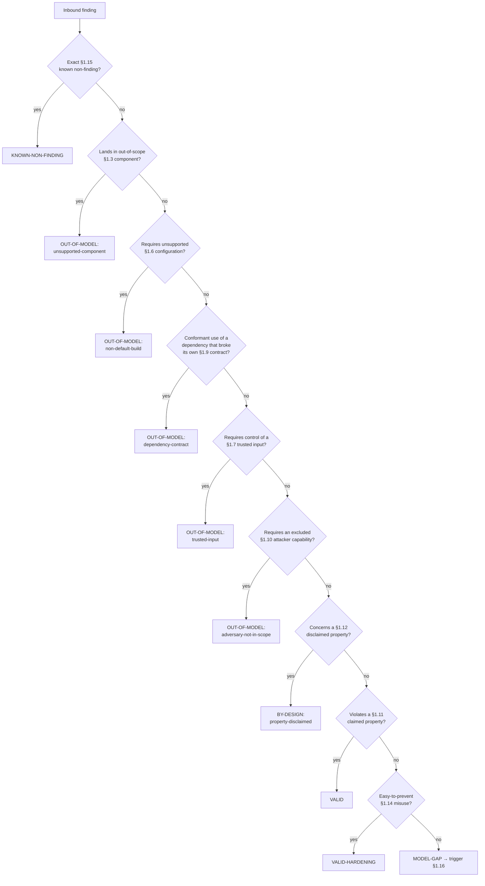

# anytopdf threat model

## 1.1 Header

- **Project**: anytopdf (`anytopdf` CLI and its four crates: `anytopdf-core`, `anytopdf-builtin`, `anytopdf-pdf`, `anytopdf-cli`).
- **Modeled version**: commit `35bc4072837e4453cad187f4417dc3499daba25d` on `main` (CHANGELOG section "0.2.0", not yet tagged; the last tag is `v0.1.0`). Production sources (`crates/*/src`), the README, PLUGIN_PROTOCOL, ARCHITECTURE and `schemas/` are identical from `5baa9d6` to this commit; later commits in that range change tests only. This commit is on the local `main` and was not yet pushed to `origin/main` when the model was written. Bind triage to the pushed commit with the same tree.
- **Date**: 2026-10-05.
- **Authors**: generated draft, for review by the anytopdf maintainers.
- **Generation metadata**:
  - Model/agent: Claude Opus 5.5 (`claude-opus-5-5`) running in Claude Code, with three Claude Sonnet surface-pass sub-agents.
  - Effort level: medium.
  - Plugins/skills used: `threat-model` (orchestrator), `threat-model-recon`, `threat-model-surface`, `threat-model-interview` (draft-first mode; wave 1 answered 2026-10), `threat-model-authoring`, `threat-model-backtest`, `threat-model-sidecar`, and the plugin's `tests/harness/validate_model.py` validator.
- **Version binding**: a report against version *N* is triaged against this model as it stood at *N*, not against HEAD.
- **Reporting cross-reference**: findings that break a §1.11 property go to the maintainers through the GitHub repository `adeelahmad/anytopdf-rs` (the project has no `SECURITY.md` yet). Findings that land in §1.3 or §1.12 are closed by citing this document.
- **Status**: under maintainer review, 2026-10-05 (wave 1 answered). An **inferred** claim may escalate a report but never close it. An **assumption** closes nothing under the declared `strict` policy.
- **Triage policy**: `strict`. An **assumption** escalates like an **inferred** claim and never closes a report.
- **Provenance legend**: *documented* = stated in a maintainer-authored public file, cited by locator; *maintainer* = a dated maintainer answer to this process; *assumption* = a conservative default the author applies until §1.18 ratifies it; *inferred* = reasoned from code or absence, still open in §1.18.
- **Draft confidence**: 139 documented / 65 maintainer / 9 inferred / 1 assumption.
- **Backtest note**: 31-item corpus in 29 clusters, covering all six in-scope components and all eight contract dimensions. 10 items carry a real historical outcome (fix commits and CHANGELOG 0.1.0 reliability fixes in this repository, all `fixed`); 21 were synthesized. Re-routed after the wave 1 answers. Disposition histogram: 11 VALID; 10 BY-DESIGN: property-disclaimed (8 closed, 2 escalated); 2 KNOWN-NON-FINDING (closed); 2 OUT-OF-MODEL: trusted-input (closed); 1 OUT-OF-MODEL: adversary-not-in-scope (closed); 1 OUT-OF-MODEL: dependency-contract (closed); 4 MODEL-GAP, each owned by an unresolved matrix row and a §1.18 question (Q6, Q8, Q11, Q17). Fail-safe figure: 0 of 10 historically-fixed items route to a closing disposition; all 10 route VALID. 14 of 31 items (45%) close outright; the two remaining escalations rest on silence-basis disclaimers (D6, D7). No routing contradicted a historical outcome.
- **Sibling models**: none. One model covers the whole workspace.

**What anytopdf is.** anytopdf is a command-line converter. A user points it at files or directories of images, text, subtitles, video and audio. It writes one searchable PDF: visible pages, an invisible text layer with OCR and captions, a provenance page, and an embedded JSON manifest. It calls optional local tools (FFmpeg, ExifTool, Tesseract, docTR, Apple Vision). It also runs third-party "runtime plugins", which are separate executables found on `PATH`. `anytopdf extract` reads the manifest back out of a PDF. It is a single-user tool that runs with the user's own permissions. It has no server, daemon or network listener.

### Glossary

- **Disposition**: the one outcome a triager assigns to a report (§1.17), such as `VALID` or `BY-DESIGN: property-disclaimed`.
- **Sink**: the code location where attacker-influenced data has its effect.
- **Claimed property** (§1.11): a guarantee the project makes. A violation is a bug.
- **Disclaimed property** (§1.12): a guarantee the project does not make. Reports about it close as by-design.
- **False friend**: a feature that looks like a security control but is not one.
- **Provenance tag**: the bracketed note after a claim that says where it comes from.
- **Runtime plugin**: an executable named `anytopdf-plugin-*` that anytopdf finds and runs.
- **Provider**: an optional local tool anytopdf runs, such as FFmpeg or Tesseract.
- **Job workspace**: the private temporary directory one run uses for derived files.
- **Profile**: `archive` (default, full detail) or `share` (strips paths and most metadata).

### Triager quick-start

> Given an inbound finding:
> 0. Read the triage policy above. It is `strict`, so an **assumption** may only escalate in step 8.
> 1. Find the sink. Look up its row in the §1.7 input-trust table. For "downstream may assume X" reports, use the §1.8 output table.
> 2. Find the contract dimension: numeric domain, failure atomicity, recursive or cyclic topology, callback execution, serialization, reference lifecycle, concurrency, or resource complexity. Follow the component's §1.7 matrix row to its owning claim.
> 3. Check what the attacker must control against §1.7 and §1.10. Input bytes and file names are one thing. CLI flags, environment variables, `PATH` and installed plugins are another.
> 4. Check the component against §1.2 and §1.3, and any required flag or feature against §1.6.
> 5. If the root cause is in a crate or an external tool, apply §1.9.
> 6. Apply §1.17's precedence order, starting with an exact §1.15 known-non-finding match.
> 7. Assign exactly one §1.17 disposition and cite the section and its provenance tag. If nothing fits, assign `MODEL-GAP` and trigger §1.16. Do not improvise.
> 8. **Before closing, check the provenance of the claim that licenses the close.** This applies to every `OUT-OF-MODEL: *`, `BY-DESIGN: *` and `KNOWN-NON-FINDING` route.
>    - **documented** or **maintainer** → close.
>    - **inferred** → escalate, never close.
>    - **assumption** → escalate (policy is `strict`).
>    - A §1.12 disclaimer whose Conditions cell says "basis: absence" never closes a `security-critical` report. Escalate it.
>    Record the outcome as `closed`, `provisional` or `escalated` (§1.17).

## 1.2 Scope and intended use

anytopdf is meant for one person converting their own media and documents into a searchable, self-describing PDF on their own machine *(documented, README intro "a pluggable media/document ingestion engine")*. Typical uses are archiving a folder of photos, recordings and notes, and producing an "evidence file" that agents can index *(documented, README "Roadmap" "anytopdf is meant to produce an evidence file")*.

The deployment context is a CLI run by a local user, with the user's permissions. There is no long-running service. The webhook, IMAP, job-queue and printer intake channels are unshipped roadmap items *(documented, README "Roadmap" "Intake channels", all unchecked)*. Since this revision, the job queue with signed webhooks and an HTTP upload listener, the remote print front and the MCP server have shipped; see §1.16 "Shipped since this revision". They are not yet modeled.

Roles:

- The **operator** runs the command. They choose the flags, the environment, the output paths and which plugins are installed *(maintainer, 2026-10)*.
- The **input author** wrote the bytes and names of the files being converted. That may be someone other than the operator, such as the sender of an attachment *(maintainer, 2026-10)*.
- **Plugin authors** ship executables the operator chose to install. Those executables are trusted native code *(documented, PLUGIN_PROTOCOL "Host validation and execution policy" "Plugins remain trusted native processes")*.

| Component family | Representative entry point | Touches outside the process | In model? |
| --- | --- | --- | --- |
| `cli-commands` | `anytopdf convert`, `probe`, `doctor`, `plugins`, `capabilities`; output naming and publishing (`crates/anytopdf-cli/src/convert.rs`, `publish.rs`, `naming.rs`, `events.rs`) | filesystem writes, stdout/stderr, env (`SOURCE_DATE_EPOCH`) | in |
| `cli-extract` | `anytopdf extract <pdf>` (`crates/anytopdf-cli/src/extract.rs`, `crates/anytopdf-pdf/src/attachments.rs`) | filesystem reads, stdout | in |
| `input-importers` | directory discovery and the image, text, subtitle, video and audio importers (`crates/anytopdf-builtin/src/discovery.rs`, `importers/`) | filesystem, child processes (FFmpeg for video) | in |
| `provider-adapters` | metadata, OCR and caption enrichers (`crates/anytopdf-builtin/src/metadata.rs`, `ocr.rs`, `captions.rs`) | child processes, filesystem, network via docTR | in |
| `plugin-host` | plugin discovery, invocation, response validation, the pipeline and graph validation (`crates/anytopdf-core/src/external.rs`, `process.rs`, `pipeline.rs`, `model.rs`) | child processes, env (`PATH`, `ANYTOPDF_PLUGIN_PATH`), filesystem | in |
| `pdf-renderer` | the built-in renderers (tagged PDF/A-3a through `krilla` by default, `--renderer pdfa`; plain PDF through `printpdf`, `--renderer pdf`), fonts including the bundled DejaVu Sans fallback, attachments, provenance page (`crates/anytopdf-pdf/src/`) | filesystem, env (`ANYTOPDF_FONT`) | in |
| `release-tooling` | `scripts/`, `Makefile`, CI workflows | network, filesystem | out (§1.3) |
| `example-plugin` | `examples/anytopdf-plugin-example.py` | filesystem | out (§1.3) |
| `test-suites` | `tests/`, `crates/*/tests/`, `#[cfg(test)]` modules | filesystem | out (§1.3) |
| `third-party-plugins` | any installed `anytopdf-plugin-*` executable | anything the user can do | out (§1.3) |

## 1.3 Out of scope (explicit non-goals)

- **Hostile multi-user or service deployment.** anytopdf is not a conversion service and has no tenant isolation. Untrusted-input handling for the intake channels is an unshipped roadmap item *(documented, README "Security and plugins" "Untrusted-input handling shipped with the intake channels")*.
- **Third-party plugin code.** A plugin is an executable the operator installed. What it does with the user's permissions is the plugin's and operator's concern *(documented, README "Diagnostics and strict mode" "Install only trusted plugins or use `--no-plugins`")*. The host's checks on plugin *responses* stay in scope (P4).
- **Release, packaging and bootstrap tooling** (`scripts/`, `Makefile`, CI). These are build and SDLC tooling, not part of the shipped `anytopdf` binary. The shipped archive contains the binary only *(maintainer, 2026-10)*.
- **The example plugin** (`examples/anytopdf-plugin-example.py`) is a demonstration: "It is not an IGL decoder" *(documented, PLUGIN_PROTOCOL "Working example")*. It is not built into the binary. Reports against it close as `unsupported-component` *(maintainer, 2026-10)*.
- **Test code** under `tests/`, `crates/*/tests/` and `#[cfg(test)]` modules. It is not compiled into release builds *(maintainer, 2026-10)*.
- **Design and spike documents** under `docs/`.
- **External providers' own bugs** (FFmpeg, ExifTool, Tesseract, docTR, Apple Vision). They are dependencies, routed by §1.9, not components.
- **Signing and notarization** of binaries and output PDFs are future work *(documented, CHANGELOG "0.1.0" "signing/notarization, and automatic updates are future work")*.

The build compiles nothing from the out-of-scope directories into the `anytopdf` binary. The workspace members are only the four `crates/` *(documented, `Cargo.toml` `[workspace] members`)*.

## 1.4 Trust boundaries and data flow

```
 operator (trusted: flags, env, PATH, installed plugins)
     |
     v
 [cli-commands] --paths--> [input-importers] <--- input files, sibling sidecars (UNTRUSTED bytes and names)
     |                           |
     |                     derived PNGs, units
     |                           v
     |                 [plugin-host / pipeline] <---> runtime plugins (trusted code; responses validated)
     |                           |  ^
     |                           |  +---- [provider-adapters] <---> ffmpeg, exiftool, tesseract, docTR, Vision
     |                           v
     |                    [pdf-renderer] ---> staged PDF in job workspace
     v
 published PDF, sidecar JSON, --dump-graph  --->  output reader (may be a third party under --profile share)

 [cli-extract] <--- PDF and sibling .manifest.json/.chunks.json (UNTRUSTED)
```

There are three trust boundaries.

1. **Input files → importers.** File bytes, file names, directory structure and sibling sidecar files come from the input author. The operator only chooses which paths to pass *(maintainer, 2026-10)*.
2. **Plugin responses → host.** The host treats a plugin's response JSON as data to validate. It checks identity, paths and numbers before the response enters the graph *(documented, PLUGIN_PROTOCOL "Host validation and execution policy")*. The plugin process itself is on the trusted side.
3. **Output → reader.** Under `--profile share` the reader of the PDF and JSON is treated as a third party who should not learn local paths *(documented, README "Embedded manifest and chunks" "The `share` profile omits absolute paths")*.

Reachability preconditions:

- `input-importers`: a finding is in model only if input bytes, a file name, or a directory layout under a path the operator passed can reach it *(maintainer, 2026-10)*.
- `provider-adapters`: in model only if input content can reach it. Providers see the original file (ExifTool, ffprobe, FFmpeg) or a derived PNG in the workspace (OCR) *(maintainer, 2026-10)*.
- `plugin-host`: findings about response validation need only a response file. Findings about discovery need control of a directory on `PATH` or `ANYTOPDF_PLUGIN_PATH`, which §1.10 excludes *(documented, README "Plugin model" "discovered from `PATH` and directories in `ANYTOPDF_PLUGIN_PATH`")*.
- `pdf-renderer`: in model when graph text or images derived from input reach it.
- `cli-extract`: in model only if the bytes of a PDF passed to `extract`, or the sidecar files beside it, reach it. Crashes, wrong exit codes and corrupted output are bugs there; size and decompression limits are not promised *(maintainer, 2026-10)*.
- `cli-commands`: findings about naming, publishing and redaction are in model when input names or contents reach them. Findings that need a hostile flag value are `trusted-input`.

## 1.5 Assumptions about the environment

- **Platform.** macOS, Linux (glibc and static musl) and Windows MSVC builds are supported release targets *(documented, README "Build" "Linux fully-static" and "Windows MSVC builds use static CRT flags")*.
- **Concurrency.** anytopdf runs one pipeline sequentially in one process. No threads, mutexes or async runtimes appear in the pipeline or importers *(maintainer, 2026-10)*. Two concurrent runs share only the filesystem.
- **Temporary directory.** The job workspace is created with `tempfile` under the system temp directory (`crates/anytopdf-core/src/pipeline.rs:39`). anytopdf assumes that directory is private to the user *(maintainer, 2026-10)*.
- **Providers and plugins** are found by name on `PATH` (`which` crate) and `ANYTOPDF_PLUGIN_PATH`. Whatever executable those resolve to is trusted *(maintainer, 2026-10)*.
- **Fonts** come from `ANYTOPDF_FONT` or a fixed list of system font paths, and are trusted *(documented, README "Reliability and operation" "Set `ANYTOPDF_FONT` to a TTF file")*.

### No-surprise side-effects inventory

| Effect | Stance | Where | Provenance |
| --- | --- | --- | --- |
| Child processes | present | FFmpeg/ffprobe, ExifTool, Tesseract, Python/docTR, provider version probes, runtime plugins. All use argv with no shell; input paths are canonical absolute paths. | *(documented, README "Optional runtime providers")* |
| Filesystem reads | present | input files, sibling caption sidecars `<stem>.{srt,vtt,txt,md}`, `--transcript` files, fonts, PDFs for `extract` and their sidecars | *(documented, README "Reliability and operation")* |
| Filesystem writes | present | job workspace; output PDF, `<out>.manifest.json`/`<out>.chunks.json` (only if embedding fails), `--dump-graph`; staging files beside each destination; missing parent directories of outputs are created | *(documented, README "Writes are staged and atomically published")* |
| Environment reads | present | `PATH`, `ANYTOPDF_PLUGIN_PATH`, `ANYTOPDF_FONT`, `SOURCE_DATE_EPOCH`. A scan finds no other `env::var` reads in `crates/*/src`. | *(documented, README "Plugin model", "Reliability and operation")* |
| Network from anytopdf code | absent | `grep -rnE 'TcpStream\|UdpSocket\|TcpListener\|reqwest\|ureq\|hyper' crates/*/src` returns 0 hits | *(maintainer, 2026-10)* |
| Network from providers | conditional | docTR "may download model weights on first use". FFmpeg may open URLs that a crafted container references; anytopdf does not restrict FFmpeg protocols. | *(documented, README "docTR may download model weights on first use")*; FFmpeg part *(inferred, Q15)* |
| Signal handlers | absent | `grep -rniE 'ctrlc\|sigaction\|signal_hook\|SIGINT' crates/*/src` returns 0 hits | *(maintainer, 2026-10)* |
| Process-global state | absent | no `set_var` or `set_current_dir` (`grep -rn 'set_var\|set_current_dir' crates/*/src`, 0 hits) | *(maintainer, 2026-10)* |
| stdout/stderr | present | stdout: `--json` documents and `extract` output. stderr: diagnostics, summary, `error:` lines, NDJSON events. | *(documented, README "Reliability and operation" "diagnostics go to stderr")* |
| `unsafe` code | conditional | one `unsafe` call, in the Apple Vision OCR path (crates/anytopdf-builtin/src/ocr.rs:388), compiled only with the `apple-vision` feature on macOS | *(maintainer, 2026-10)* |

## 1.6 Build-time and configuration variants

The defaults below are supported production settings. None is marked dev-only or discouraged, so `OUT-OF-MODEL: non-default-build` has no configuration to cite today *(maintainer, 2026-10)*.

| Variant | Default | Effect on the model | Support |
| --- | --- | --- | --- |
| Cargo feature `apple-vision` | on (macOS only) | Adds Apple Vision OCR through Objective-C bindings, including the only `unsafe` block | supported *(documented, README "On macOS the `apple-vision` Cargo feature uses native Vision")* |
| `--no-default-features` | off | Drops Apple Vision; used for static musl builds | supported *(documented, README "Build" "Linux fully-static" build command)* |
| Runtime plugins enabled | on (`--no-plugins` off) | Every `anytopdf-plugin-*` on `PATH` and `ANYTOPDF_PLUGIN_PATH` runs its manifest command on each `convert`, `probe` and `plugins` call | supported *(documented, PLUGIN_PROTOCOL "`--no-plugins`: bypass runtime discovery entirely")* |
| `--allow-plugin-kind` / `--deny-plugin-kind` | all kinds | Controls registration, not execution | supported *(documented, PLUGIN_PROTOCOL "Capability filters control registration, not executable permissions")* |
| `--plugin-timeout` | 60 s, minimum 1, no maximum | Raising it weakens P5 for plugins | supported *(documented, PLUGIN_PROTOCOL "bound each manifest/request invocation (default 60)")* |
| `--renderer` | `pdfa` (tagged PDF/A-3a through `krilla`) | `pdf` selects `printpdf`; both hidden layers filter on `is_searchable_content` (P8); `runtime:NAME` runs a plugin renderer | supported *(documented, README "Rendering")* |
| `--profile` | `archive` | `archive` keeps paths and metadata; `share` enables P7 | supported *(documented, README "`--profile archive\|share` (default `archive`)")* |
| `--max-image-frames`, `--max-video-frames` | 0 (unlimited) | A value above 0 enables P12 | supported *(documented, README "`--max-image-frames N` caps the count (0 = unlimited)")* |
| `--overwrite` | off | Lets an existing output be replaced; does not relax P2 | supported *(documented, README "input files and explicit transcripts are protected even with that flag")* |
| `--include-hidden` | off | Directory scans include dot-files and dot-directories | supported *(documented, `crates/anytopdf-cli/src/cli.rs` `include_hidden` help text)* |
| `--no-embedded-subtitles`, `--ocr off` | off | Removes FFmpeg subtitle extraction or OCR providers from the run | supported *(documented, README "Reliability and operation")* |

## 1.7 Assumptions about inputs

### Per-input-operand trust table

Coverage: 31 rows covering the operands of `convert`, `extract`, plugin discovery and plugin responses, the built-in importers and the provider adapters. `probe`, `doctor`, `plugins` and `capabilities` take only the operands already listed (paths and global plugin flags) and have no separate rows.

| Entry point | Input operand | Attacker-controllable? | Control kind | Caller must enforce | Provenance |
| --- | --- | --- | --- | --- | --- |
| `convert` | input paths on the command line | no | resource-name | Choose which files and trees to convert | *(maintainer, 2026-10)* |
| `convert` | bytes of each input file | yes | data, size | none for integrity claims (P2, P15); bound size yourself (D4) | *(maintainer, 2026-10)* |
| `convert` | file and directory names inside a scanned tree | yes | resource-name | none: names reach subprocesses only as canonical absolute paths after `crates/anytopdf-builtin/src/discovery.rs:67` | *(maintainer, 2026-10)* |
| discovery | directory depth and file count in a scanned tree (symlinks are operator-controlled, D14) | yes | object-topology, size | Do not scan untrusted trees without resource limits (D4) | *(inferred, Q8)* |
| caption enricher | contents of sibling sidecars `<stem>.srt/.vtt/.txt/.md` next to media | yes | resource-name, data | Control symlinks in the input tree; a symlinked sidecar is followed and its target embedded (D14) | *(maintainer, 2026-10)* |
| `convert` | `--transcript` files | no | resource-name | Pass only files you mean to embed | *(documented, README "`--transcript` is never silently ignored")* |
| `convert` | `-o`, `--output-dir`, `--dump-graph`, `--overwrite` | no | resource-name | Put outputs outside input directories | *(documented, README "Put outputs outside input directories")* |
| `convert` | `--filter` regex | no | data | none; the `regex` crate matches in linear time | *(maintainer, 2026-10)* |
| `convert` | `--video-interval`, `--scene-threshold`, `--dedupe-distance` | no | size | Values are range-checked; out-of-range values exit 2 | *(documented, README "Exit codes" "2 \| usage \| Invalid option or value")* |
| `convert` | `--max-image-frames`, `--max-video-frames` | no | size | Set a non-zero cap for untrusted media (P12) | *(documented, README "`--max-video-frames` also bounds extracted frames per pass")* |
| `convert` | `--profile`, `--no-provenance-page`, `--strict`, `--fail-fast`, `--json`, `--events`, `--quiet` | no | type-class | Choose `share` before sharing outputs | *(maintainer, 2026-10)* |
| `convert` | `--lang`, `--ocr`, `--renderer` | no | type-class, collaborator-implementation | `--renderer runtime:NAME` runs a plugin renderer; choose only installed, trusted ones | *(documented, PLUGIN_PROTOCOL "`convert --renderer runtime:NAME`")* |
| global | `--no-plugins`, `--plugin-timeout`, `--allow/deny-plugin-kind` | no | type-class, rate | Use `--no-plugins` where installed plugins are not trusted | *(maintainer, 2026-10)* |
| environment | `PATH`, `ANYTOPDF_PLUGIN_PATH` | no | resource-name, collaborator-implementation | Keep every directory on them writable only by trusted users | *(documented, README "Install only trusted plugins")* |
| environment | `ANYTOPDF_FONT` | no | resource-name | Point it only at a trusted TTF file | *(maintainer, 2026-10)* |
| environment | `SOURCE_DATE_EPOCH` | no | data | An invalid value exits 2 | *(documented, README "an invalid value exits 2")* |
| image importer | image pixels, dimensions, frame count, EXIF orientation | yes | data, size | Bound decoded size yourself; no pixel limit is set (D4) | *(documented, README "Security and plugins" "size and page caps" unchecked)* |
| text importer | whole file (UTF-8 or lossy) | yes | data, size | Bound size yourself (D4) | *(documented, README "Content-sniffed text importer (csv, json, log, code; lossy for non-UTF-8)")* |
| subtitle importer | `.srt`/`.vtt` cues and timestamps | yes | data, size | none for parsing; bound size yourself (D4) | *(maintainer, 2026-10)* |
| video importer | container streams decoded by FFmpeg | yes | data, size | Trust and patch FFmpeg (§1.9); bound duration yourself (D4) | *(documented, README "each video extraction pass 300 seconds")* |
| metadata enricher | ExifTool and ffprobe JSON describing the input | yes | serialized-state | Treat metadata strings as untrusted (§1.8) | *(maintainer, 2026-10)* |
| OCR enricher | text recognized from input pixels | yes | data | Treat OCR text as untrusted (§1.8) | *(maintainer, 2026-10)* |
| plugin discovery | executables named `anytopdf-plugin-*` | no | collaborator-implementation, callback-code | Install only trusted plugins | *(documented, README "Install only trusted plugins or use `--no-plugins`")* |
| plugin discovery | manifest JSON (`protocol`, `name`, `capabilities`) | conditional (installed plugin) | serialized-state | none: protocol and non-empty name/capabilities are checked (P4) | *(documented, PLUGIN_PROTOCOL "Manifest")* |
| plugin response | response file (size, type) | conditional (installed plugin) | size, serialized-state | none — plugin-response-validation | *(documented, PLUGIN_PROTOCOL "Captured output and response JSON are limited to 16 MiB each")* |
| plugin response | unit and source IDs, `source_id` | conditional (installed plugin) | data | none — plugin-response-validation | *(documented, PLUGIN_PROTOCOL "Enrichment responses must preserve existing source and unit identities")* |
| plugin response | `visual_path` | conditional (installed plugin) | resource-name | none — plugin-response-validation | *(documented, PLUGIN_PROTOCOL "The host resolves symlinks before validating the path")* |
| plugin response | annotations, regions, times, confidence | conditional (installed plugin) | data | none — plugin-response-validation | *(documented, PLUGIN_PROTOCOL "Annotations must have a provider, finite coordinates")* |
| plugin response | source `sha256` and `size` | conditional (installed plugin) | data | Trust installed plugins for content IDs; a supplied digest skips host hashing (`crates/anytopdf-core/src/model.rs:367`) | *(inferred, Q13)* |
| plugin response | `warnings[]` strings | conditional (installed plugin) | data | none — plugin-warnings-recoded | *(documented, PLUGIN_PROTOCOL "reports every plugin-supplied warning string as the diagnostic code `plugin.warning`")* |
| `extract` | PDF bytes, object graph, embedded file streams; sibling `<pdf>.manifest.json` and `<pdf>.chunks.json` | yes | serialized-state, object-topology, size | Bound file size yourself (D4); treat output as unverified (D7) | *(maintainer, 2026-10)* |

**Size and shape.** Inputs are read whole into memory: text, subtitles, TIFF files and every source for its SHA-256 *(maintainer, 2026-10)*. Subprocess output and plugin responses are the only streams with a hard cap (16 MiB) *(documented, README "Captured stdout, stderr and plugin response JSON each have a 16 MiB limit")*.

### Contract-dimension matrix

| Component | Dimension | Status | Conditions / boundary | Routes to | Provenance |
| --- | --- | --- | --- | --- | --- |
| cli-commands | numeric domain | claimed | numeric flags are range-checked and bad values exit 2 | P10 | *(documented, README "Exit codes")* |
| cli-commands | failure atomicity | claimed | per file: staged then renamed; cross-file atomicity is D10 | P3 | *(documented, README "Writes are staged and atomically published")* |
| cli-commands | recursive/cyclic topology | N/A | the CLI handles flat lists of paths; tree walking belongs to input-importers | — | *(maintainer, 2026-10)* |
| cli-commands | callback execution | N/A | the CLI runs no collaborators itself; plugins and providers run through plugin-host and provider-adapters | — | *(maintainer, 2026-10)* |
| cli-commands | serialization/reconstruction | claimed | `--json` writes exactly one versioned document; `--events` ends with one `run.finished` | P10 | *(documented, README "write exactly one versioned JSON document to stdout")* |
| cli-commands | reference lifecycle | disclaimed | staging and workspace files can remain after an abnormal exit | D11 | *(documented, README "Writes are staged and atomically published" is the only lifecycle promise; basis: absence)* |
| cli-commands | concurrency/reentrancy | disclaimed | no coordination between concurrent runs | D12 | *(documented, README "Reliability and operation" has no concurrency statement; basis: absence)* |
| cli-commands | resource complexity | disclaimed | no total page, size or memory cap | D4 | *(documented, README "Security and plugins" "size and page caps" unchecked)* |
| cli-extract | numeric domain | claimed | malformed offsets, lengths or numbers end in exit 3, not a crash or a wrong exit code; size exhaustion is D4 | P17 | *(maintainer, 2026-10)* |
| cli-extract | failure atomicity | N/A | `extract` writes only to stdout and exits 0 or 3 | — | *(documented, README "A PDF with no embedded or sidecar manifest exits 3")* |
| cli-extract | recursive/cyclic topology | unresolved | PDF object references are resolved by `lopdf` with no visited-set in this crate; a crash here is a bug (P17), but whether non-termination is one is open | Q17 | *(inferred, Q17)* |
| cli-extract | callback execution | N/A | `extract` runs no plugins or providers (`crates/anytopdf-cli/src/main.rs:57`) | — | *(maintainer, 2026-10)* |
| cli-extract | serialization/reconstruction | claimed | a version-matched manifest or chunks file is schema-validated; other versions warn and skip validation | P9 | *(documented, README "A version-matched manifest or chunks file that does not match its schema exits 3")* |
| cli-extract | reference lifecycle | N/A | `extract` creates no files | — | *(maintainer, 2026-10)* |
| cli-extract | concurrency/reentrancy | N/A | read-only and single-threaded | — | *(maintainer, 2026-10)* |
| cli-extract | resource complexity | disclaimed | the whole PDF is read into memory (`crates/anytopdf-cli/src/extract.rs:13`); no size cap | D4 | *(maintainer, 2026-10)* |
| input-importers | numeric domain | disclaimed | no pixel, dimension or file-size limit; frame caps only when set (P12) | D4 | *(documented, README "Security and plugins" "size and page caps" unchecked)* |
| input-importers | failure atomicity | claimed | a failing input is skipped with a warning and the batch continues | P15 | *(documented, README "Exit codes" "a failing input (corrupt, unsupported or unreadable) is skipped")* |
| input-importers | recursive/cyclic topology | unresolved | directory scans call `follow_links(false)` (`crates/anytopdf-builtin/src/discovery.rs:27`); depth is unbounded | Q8 | *(inferred, Q8)* |
| input-importers | callback execution | disclaimed | the video importer runs FFmpeg with the user's permissions, bounded only by timeouts | D1 | *(documented, README "These limits are safeguards, not an OS sandbox")* |
| input-importers | serialization/reconstruction | unresolved | decoding of hostile image, video and subtitle bytes; whether a panic or abort is a bug | Q6 | *(inferred, Q6)* |
| input-importers | reference lifecycle | claimed | derived files live inside one job workspace | P16 | *(documented, README "Design invariants" "Temporary derived artifacts live inside one job workspace")* |
| input-importers | concurrency/reentrancy | N/A | importers run one at a time in one thread | — | *(maintainer, 2026-10)* |
| input-importers | resource complexity | disclaimed | memory, disk and CPU scale with input | D4 | *(documented, README "Security and plugins" "size and page caps" unchecked)* |
| provider-adapters | numeric domain | unresolved | numbers parsed from tool output (TSV, JSON, `pts_time`) | Q6 | *(inferred, Q6)* |
| provider-adapters | failure atomicity | claimed | a failed enricher's changes are rolled back | P6 | *(documented, ARCHITECTURE "Source, graph and unit enrichers roll back their in-memory changes on failure")* |
| provider-adapters | recursive/cyclic topology | disclaimed | sidecars are found by swapping the media extension; a symlinked sidecar is followed and its target read | D14 | *(maintainer, 2026-10)* |
| provider-adapters | callback execution | disclaimed | external tools run with the user's permissions | D1 | *(documented, README "These limits are safeguards, not an OS sandbox")* |
| provider-adapters | serialization/reconstruction | unresolved | parsing of ExifTool/ffprobe JSON and Tesseract TSV from hostile media | Q6 | *(inferred, Q6)* |
| provider-adapters | reference lifecycle | claimed | derived files live in the job workspace | P16 | *(documented, README "Design invariants" "Temporary derived artifacts live inside one job workspace")* |
| provider-adapters | concurrency/reentrancy | N/A | adapters run sequentially | — | *(maintainer, 2026-10)* |
| provider-adapters | resource complexity | claimed | per-call timeouts and 16 MiB output caps; total job time is unbounded (D4) | P5 | *(documented, README "Metadata providers have 30-second timeouts")* |
| plugin-host | numeric domain | claimed | finite coordinates, confidence in [0,1], ordered non-negative times | P4 | *(documented, PLUGIN_PROTOCOL "confidence between 0 and 1 when supplied")* |
| plugin-host | failure atomicity | claimed | failed enrichers roll back graph changes; plugin side effects are not rolled back | P6 | *(documented, PLUGIN_PROTOCOL "failed enrichers roll back graph mutations")* |
| plugin-host | recursive/cyclic topology | N/A | the graph is two flat lists; duplicate and dangling IDs are rejected by P4 | — | *(documented, ARCHITECTURE "Normalized model")* |
| plugin-host | callback execution | disclaimed | plugins are trusted native processes with no isolation | D1 | *(documented, PLUGIN_PROTOCOL "without filesystem/network isolation or hard CPU/memory quotas")* |
| plugin-host | serialization/reconstruction | claimed | response JSON is size-capped, protocol-checked and validated | P4 | *(documented, PLUGIN_PROTOCOL "Host validation and execution policy")* |
| plugin-host | reference lifecycle | claimed | the workspace lives for the run; plugins may still write elsewhere (D1) | P16 | *(documented, ARCHITECTURE "Temporary derived artifacts" / README "Design invariants")* |
| plugin-host | concurrency/reentrancy | N/A | plugins are invoked one at a time | — | *(maintainer, 2026-10)* |
| plugin-host | resource complexity | claimed | 60 s default per invocation, 16 MiB caps; descendants not contained (D3) | P5 | *(documented, PLUGIN_PROTOCOL "bound each manifest/request invocation (default 60)")* |
| pdf-renderer | numeric domain | disclaimed | page count and image size follow the input | D4 | *(documented, README "Security and plugins" "size and page caps" unchecked)* |
| pdf-renderer | failure atomicity | claimed | a render failure publishes nothing and exits 6 | P10 | *(documented, README "Exit codes" "Rendering failed; nothing was published")* |
| pdf-renderer | recursive/cyclic topology | N/A | renders a flat list of pages | — | *(maintainer, 2026-10)* |
| pdf-renderer | callback execution | N/A | the built-in renderer runs no collaborators; runtime renderers belong to plugin-host | — | *(maintainer, 2026-10)* |
| pdf-renderer | serialization/reconstruction | unresolved | untrusted text is written into PDF strings by `krilla` (default) or `printpdf` | Q11 | *(inferred, Q11)* |
| pdf-renderer | reference lifecycle | claimed | the PDF is staged in the job workspace before publishing | P16 | *(documented, README "Design invariants" "Temporary derived artifacts live inside one job workspace")* |
| pdf-renderer | concurrency/reentrancy | N/A | single-threaded render | — | *(maintainer, 2026-10)* |
| pdf-renderer | resource complexity | disclaimed | memory holds the whole PDF, then re-parses it to embed attachments | D4 | *(documented, README "Security and plugins" "size and page caps" unchecked)* |

**Failure postconditions.** Enricher failure leaves the graph as it was before that enricher *(documented, ARCHITECTURE "Failure and publication boundaries")*. Plugin side effects (files written, network use) are not undone. A failed publish leaves earlier PDFs of an `--output-dir` run in place; nothing is rolled back across files (D10).

## 1.8 Assumptions and guarantees about outputs

Default taint: output is exactly as untrusted as the input it derives from. No sanitization, normalization or encoding for HTML, SQL, shells or terminals is performed *(maintainer, 2026-10)*.

| Output channel | Component | Taint | Downstream must not assume | Provenance |
| --- | --- | --- | --- | --- |
| PDF visible pages (text pages, images) | pdf-renderer | same as input; control characters are dropped when wrapping | text is safe to render as HTML or run in a shell; complex scripts render correctly (D9) | *(documented, README "Text/transcript units become normal visible text pages")* |
| PDF invisible text layer | pdf-renderer | same as input (OCR, captions, transcripts, objects, barcodes, times) | it is free of personal data; it matches the visible page | *(documented, README "Search model" "The hidden layer carries content only")* |
| Provenance page | pdf-renderer | assembled from source basenames, SHA-256, sizes, types, provider names and versions; basenames are attacker-chosen | basenames are unique or trustworthy | *(documented, README "Provenance page as the last page")* |
| Embedded `anytopdf-manifest.json` / `anytopdf-chunks.json` | pdf-renderer, cli-commands | same as input; under `archive` the manifest carries all non-volatile provider metadata, including GPS and camera fields | it is authentic (D7) or free of metadata (D5) | *(documented, README "Embedded manifest and chunks")* |
| Sidecar `<out>.manifest.json` / `<out>.chunks.json` | cli-commands | identical to the embedded documents; written only when embedding fails | they exist next to every PDF | *(documented, README "If embedding fails, the same JSON is written beside the PDF")* |
| `--json` stdout (`convert`, `probe`, `doctor`, `plugins`, `capabilities`) | cli-commands | constrained: valid JSON with a schema id; strings carry file names and messages | strings are free of control characters once decoded; `share` hides basenames | *(documented, README "contracts live in `schemas/`")* |
| `extract` stdout | cli-extract | same as the PDF it read; a version-mismatched manifest is echoed without validation | the manifest describes this PDF's pages; `origin: sidecar` documents belong to the PDF | *(documented, README "adds an `extract.version-mismatch` warning")* |
| stderr human lines (`INFO`/`WARNING`, `Wrote`, `Summary`, `skipped`, `error:`) | cli-commands | assembled from paths, file names, provider and plugin messages; printed raw | the text is safe for a terminal (D8); it is path-free under `archive` | *(documented, README "Diagnostics and strict mode")* |
| stderr NDJSON events (`--events`) | cli-commands | constrained: one JSON object per line, final `run.finished` | the stream is complete if the reader closes stderr early | *(documented, README "Progress events")* |
| `--dump-graph` JSON | cli-commands | same as input; under `archive` it keeps paths and all metadata | it is portable or scrubbed | *(documented, README "`--dump-graph` is a diagnostic sidecar, not a portable media bundle")* |

Structural invariants that are guaranteed are promoted to §1.11: P7 (share redaction), P8 (content-only hidden layer), P10 (one JSON document, one `run.finished`).

## 1.9 Assumptions about dependencies

anytopdf has runtime dependencies. It vendors no third-party source; `Cargo.lock` pins crate versions *(documented, README "Keep `Cargo.lock` when building from source")*. Routing rule: if a dependency fails its own contract while anytopdf uses it as documented, the report is `OUT-OF-MODEL: dependency-contract` and goes upstream. If anytopdf misuses a dependency, the report is in model.

| Dependency | Relied-on property | Triaged |
| --- | --- | --- |
| `image`, `tiff` crates | decode PNG, JPEG, GIF, WebP, BMP and TIFF without memory unsafety; return errors on bad data | upstream *(maintainer, 2026-10)* |
| `krilla` (default renderer), `printpdf`, `allsorts`, `ttf-parser` | write valid PDF operators and strings from arbitrary text; shape and subset fonts; `krilla` also writes PDF/A-3a structure, XMP and associated files | upstream *(maintainer, 2026-10)* |
| `lopdf` | parse arbitrary PDF bytes in `extract` and `embed_files` without memory unsafety | upstream *(maintainer, 2026-10)* |
| `serde_json` | parse untrusted JSON with bounded nesting | upstream *(maintainer, 2026-10)* |
| `regex` | linear-time matching for `--filter` and subtitle parsing | upstream *(maintainer, 2026-10)* |
| `walkdir`, `tempfile`, `which`, `infer`, `sha2`, `uuid` | directory walking without following links when told; private temp files; `PATH` lookup; content sniffing; correct SHA-256; UUIDs | upstream *(maintainer, 2026-10)* |
| FFmpeg / ffprobe | decode hostile containers; obey the argv anytopdf passes | upstream; anytopdf owns only argv construction *(maintainer, 2026-10)* |
| ExifTool | read metadata from hostile files | upstream *(maintainer, 2026-10)* |
| Tesseract, Python + docTR | OCR a workspace PNG; docTR downloads weights on first use | upstream *(documented, README "docTR may download model weights on first use")* |
| Apple Vision (`objc2-vision`) | OCR a PNG in process | upstream *(maintainer, 2026-10)* |

## 1.10 Adversary model

Deployment context: one user running the CLI on their own workstation or CI host. Shared hosts and conversion services are out of scope (§1.3).

| Actor | In scope? | Capabilities held | Capabilities excluded | Goals | Provenance |
| --- | --- | --- | --- | --- | --- |
| input-author | yes | choose the bytes and names of files the operator converts, including the contents of sibling sidecar files | choose CLI flags or environment; create symlinks in the input tree (the operator controls the directory layout); write to `PATH`, `ANYTOPDF_PLUGIN_PATH` or the temp directory; install plugins or providers; change files while a run is in progress | overwrite user files, leak local data into shared outputs, corrupt the output, exhaust resources | *(maintainer, 2026-10)* |
| extract-pdf-author | yes | choose the bytes of a PDF passed to `extract` and the files beside it | choose CLI flags or environment | make `extract` crash, return a wrong exit code or print corrupted output; make it accept forged data | *(maintainer, 2026-10)* |
| plugin-response-author | yes, for the response only | write any response JSON: IDs, paths, numbers, warnings, metadata | act on the host outside the response (that is the plugin-code actor) | inject files from outside the workspace into the PDF, break graph identities, spoof diagnostic codes | *(documented, PLUGIN_PROTOCOL "Host validation and execution policy")* |
| output-reader | yes, under `--profile share` | read every byte of PDFs, JSON and sidecars the operator shared | access the host, the workspace, or `archive`-profile outputs that were not shared | learn absolute local paths or host metadata | *(documented, README "`share` also strips local paths")* |
| plugin-code | no | run as the user: read and write files, use the network, spawn processes | — | — | *(documented, README "plugins run with your account's permissions")* |
| local-environment-controller | no | write to a `PATH` or `ANYTOPDF_PLUGIN_PATH` directory, set `ANYTOPDF_FONT` or `TMPDIR` | — | — | *(documented, README "Install only trusted plugins or use `--no-plugins`")* |
| operator | no | choose every flag, path and environment variable | — | — | *(maintainer, 2026-10)* |
| network-attacker | no | none: anytopdf opens no listening socket; provider downloads are a §1.9 matter | — | — | *(maintainer, 2026-10)* |

## 1.11 Security properties the project provides

- **P1 `no-plugin-execution-when-disabled`** — With `--no-plugins`, no runtime plugin executable runs, including manifest commands. *Symptom*: `x-unexpected-code-execution`. *Tier*: security-critical. *(documented, PLUGIN_PROTOCOL "`--no-plugins`: bypass runtime discovery entirely")*. *Voided by*: nothing. Search: `grep -rn 'discover_with_policy\|read_manifest' crates/*/src` — every execution path goes through `discover_with_policy`, which returns early when disabled (`crates/anytopdf-core/src/external.rs:152`).
- **P2 `inputs-never-overwritten`** — No file anytopdf writes may replace a discovered input or an explicit `--transcript` file, even with `--overwrite`. This covers PDFs, `--output-dir` PDFs, `--dump-graph`, and the `<out>.manifest.json`/`<out>.chunks.json` files written when embedding fails *(maintainer, 2026-10)*. Paths are compared in canonical form. *Symptom*: `x-input-overwritten` (user data loss). *Tier*: security-critical. *(documented, README "input files and explicit transcripts are protected even with that flag")*. Conditions: hard links to an input at another path and files changed during a run are outside the claim *(assumption, Q4)*. *Voided by*: nothing. Search: `grep -rn 'sources.contains\|protected' crates/anytopdf-cli/src` — the check at `crates/anytopdf-cli/src/publish.rs:12` runs before the overwrite branch.
- **P3 `existing-output-not-replaced`** — Without `--overwrite`, an existing explicit destination is refused. Every write is staged beside the destination and renamed, so a failed write never truncates an existing file. *Symptom*: `wrong-output`. *Tier*: correctness-only. *(documented, README "An explicit existing `-o` requires `--overwrite`")*. *Voided by*: passing `--overwrite` — `crates/anytopdf-cli/src/publish.rs:28`.
- **P4 `plugin-response-validation`** — The host rejects a plugin response over 16 MiB or not a regular file, with the wrong protocol, or with changed source or unit identities. It also rejects a `visual_path` that is not the source file or inside the canonical workspace after symlink resolution, and any annotation or anchor with non-finite or out-of-range numbers. A rejected enrichment is rolled back. *Symptom*: `bad-data-accepted`. *Tier*: correctness-only, because the plugin process can read those files itself (D1). *(documented, PLUGIN_PROTOCOL "Host validation and execution policy")*. *Voided by*: no caller switch. The built-in allowance is a path equal to the source file itself (crates/anytopdf-core/src/external.rs:588). A plugin-supplied `sha256` is trusted for content IDs (`crates/anytopdf-core/src/model.rs:367`, Q13).
- **P5 `subprocess-time-and-output-bounds`** — Each provider and plugin invocation is killed at its timeout: plugins 60 s by default, metadata 30 s, OCR 180 s, subtitle extraction 120 s, each video pass 300 s. Captured stdout, stderr and plugin response files are capped at 16 MiB. *Symptom*: `hang`, `unbounded-allocation`. *Tier*: correctness-only. Threshold: a single invocation that outlives its timeout or a capture over 16 MiB is a bug; a long total job is not. *(documented, README "Captured stdout, stderr and plugin response JSON each have a 16 MiB limit")*. *Voided by*: `--plugin-timeout` has no upper bound (`crates/anytopdf-cli/src/cli.rs:20`); only the direct child is killed (`crates/anytopdf-core/src/process.rs:44`), so descendants survive (D3).
- **P6 `failed-enrichment-rolls-back`** — If a source, graph or unit enricher fails or returns an invalid graph, its in-memory changes are discarded and the run continues with a warning. *Symptom*: `wrong-output`. *Tier*: correctness-only. *(documented, ARCHITECTURE "Source, graph and unit enrichers roll back their in-memory changes on failure")*. No switch affects it.
- **P7 `share-profile-path-redaction`** — With `--profile share`, absolute local paths are removed from the manifest, chunks, `--dump-graph`, `--json` output, events, the summary and diagnostics. Source paths become base names, workspace image paths are dropped, metadata is cut to an allow-list, and location annotations are removed. *Symptom*: `info-leak`. *Tier*: security-critical. *(documented, README "`share` also strips local paths, including from stderr diagnostics, the Summary and `--json` messages")*. Conditions: covers paths and metadata, not text content (D6). *Voided by*: using the default `archive` profile — the redactor is enabled only for `share` (`crates/anytopdf-cli/src/convert.rs:136`).
- **P8 `hidden-layer-content-only`** — The invisible text layer contains only OCR, caption, transcript, object, barcode and time text. It never contains source paths or file metadata. *Symptom*: `info-leak`. *Tier*: correctness-only, because the embedded manifest in the same PDF still carries metadata under `archive` (D5). *(documented, README "Search model" "source paths and file metadata are never written into it")*. *Voided by*: nothing. Search: `grep -rn 'hidden_text_ops\|search_layer(\|is_searchable_content' crates/anytopdf-pdf/src` — both layer builders filter on `is_searchable_content`, in `crates/anytopdf-pdf/src/lib.rs` (`pdf`) and `crates/anytopdf-pdf/src/pdfa.rs` (`pdfa`, the default). Under `pdfa` the layer is text with fill opacity 0 rather than text rendering mode 3.
- **P9 `extract-schema-check`** — `extract` exits 3 when a manifest or chunks file whose `schema_version` matches the supported one fails its schema. The error names the document and the first failing JSON path. *Symptom*: `bad-data-accepted`. *Tier*: correctness-only. *(documented, README "A version-matched manifest or chunks file that does not match its schema exits 3")*. *Voided by*: any other `schema_version` skips validation with a warning (`crates/anytopdf-cli/src/extract.rs:56`).
- **P10 `cli-result-contract`** — Exit codes follow the documented 0–7 classes. `--json` writes exactly one versioned document, including on failure. `--events` ends with exactly one `run.finished` whose status matches the exit code, and a closed stderr pipe never panics. *Symptom*: `wrong-output`, `crash`. *Tier*: correctness-only. *(documented, README "Progress events" "Every run ends with exactly one `run.finished` event")*. No switch affects it.
- **P11 `transcript-never-ignored`** — A `--transcript` file is either attached to a media source or reported with a warning. It is never dropped silently. *Symptom*: `wrong-output`. *Tier*: correctness-only. *(documented, README "Searchable text and diagnostics" "`--transcript` is never silently ignored")*. No switch affects it.
- **P12 `frame-caps-when-set`** — With `--max-image-frames N` (N > 0) at most N frames of a GIF or TIFF are imported, with warning `input.frames-not-imported`. With `--max-video-frames N` at most N frames per extraction pass are kept. *Symptom*: `unbounded-allocation`. *Tier*: correctness-only. *(documented, README "`--max-image-frames N` caps the count (0 = unlimited)")*. *Voided by*: the default value 0 — `crates/anytopdf-builtin/src/importers/image_file.rs:209` and crates/anytopdf-builtin/src/importers/video.rs:189.
- **P13 `plugin-warnings-recoded`** — Every plugin-supplied warning string is reported with code `plugin.warning`, even if it imitates a built-in code. A plugin therefore cannot mark its warning as informational to slip past `--strict`. *Symptom*: `x-diagnostic-spoof`. *Tier*: correctness-only. *(documented, PLUGIN_PROTOCOL "even if it imitates a built-in code")*. *Voided by*: nothing. Search: `grep -rn 'PluginWarning' crates/anytopdf-core/src` — plugin warnings are wrapped at `crates/anytopdf-core/src/external.rs:108` before parsing.
- **P14 `reproducible-output`** — With `SOURCE_DATE_EPOCH` set and the same inputs and provider versions, output is byte-identical. *Symptom*: `wrong-output`. *Tier*: correctness-only. *(documented, README "Byte-reproducible output with `SOURCE_DATE_EPOCH` and recorded provider versions")*.
- **P15 `failed-input-isolation`** — By default a corrupt, unsupported or unreadable input is skipped with a warning naming the file, and the rest of the batch continues. `--fail-fast` stops with exit 7; `--strict` stops with exit 5. *Symptom*: `wrong-output`. *Tier*: correctness-only. Whether a panic counts as a failure here is Q6. *(documented, README "Exit codes" "the rest of the batch continues")*.
- **P16 `workspace-confinement-of-derived-files`** — Built-in importers, enrichers and the renderer write derived files only inside the per-run job workspace. Outputs reach their destination only through staged publishing. *Symptom*: `wrong-output`. *Tier*: correctness-only. *(documented, README "Design invariants" "Temporary derived artifacts live inside one job workspace")*. Plugins are not confined (D1). Cleanup after an abnormal exit is not promised (D11).

- **P17 `extract-robust-on-hostile-pdf`** — For any PDF and any sibling sidecar files, `extract` either prints one `anytopdf.extract/1` document and exits 0, or exits 3 with an error. It does not crash, return a wrong exit code, or print a corrupted document. *Symptom*: `crash`, `wrong-output`. *Tier*: correctness-only. *(maintainer, 2026-10)*. Non-termination on cyclic references is Q17. Memory and size exhaustion is D4. No switch affects it: `extract` takes no option beyond `--json` (`grep -n 'Extract' -A4 crates/anytopdf-cli/src/cli.rs`).

### Worked routing examples

| Reported | Sink | Attacker needs | Symptom | Routes to | Licensed by |
| --- | --- | --- | --- | --- | --- |
| `--profile share` run still prints an absolute input path in a diagnostic | stderr diagnostics | an input file to convert | info-leak | `VALID` | P7 |
| An installed plugin reads files outside the job workspace and opens a socket | plugin executable | being an installed plugin | x-unsandboxed-host-access | `KNOWN-NON-FINDING` **(closed)** | KNF-1 → D1 |
| A PNG with huge declared dimensions makes `convert` run out of memory | image importer | the input bytes only | unbounded-allocation | `BY-DESIGN: property-disclaimed` **(closed)** | D4 (stated limit) |
| An edited PDF carries a manifest whose hashes match forged pages | embedded manifest | write access to the PDF | integrity-bypass | `BY-DESIGN: property-disclaimed` **(escalated)** | D7, basis: absence |

The second row could also close through D1 directly, but an exact §1.15 match fires first. The fourth row has the right route, but D7 rests on silence and is security-critical, so it escalates.

## 1.12 Security properties the project does *not* provide

| ID | The project does not provide | Conditions / boundary | Tier | False friend? | Provenance |
| --- | --- | --- | --- | --- | --- |
| D1 `os-sandbox` | Filesystem, network or process isolation, or CPU/memory/disk quotas, for runtime plugins and external providers | Covers what a plugin or provider process does on the host. Does not cover the host's validation of plugin responses (P4) or the timeouts and 16 MiB caps (P5). Basis: stated limit. | security-critical | yes: timeouts, output caps and capability filters are not a sandbox | *(documented, PLUGIN_PROTOCOL "without filesystem/network isolation or hard CPU/memory quotas")* |
| D2 `capability-filter-as-execution-control` | Using `--allow-plugin-kind`/`--deny-plugin-kind` to stop a plugin from running | Manifest commands of every discovered plugin still run. Only `--no-plugins` stops execution (P1). Basis: stated limit. | security-critical | yes: a deny list is not an execution block | *(documented, PLUGIN_PROTOCOL "manifest commands still run during discovery")* |
| D3 `descendant-containment` | Stopping processes that a timed-out plugin or provider spawned | Only the direct child is killed. Basis: stated limit. | correctness-only | no | *(documented, PLUGIN_PROTOCOL "independently spawned descendants are not guaranteed to stop")* |
| D4 `untrusted-input-resource-bounds` | Size, pixel, page, frame (by default), file-count or depth caps, decompression-bomb rejection, or a total time budget for `convert` inputs and PDFs passed to `extract` | Covers memory, disk and CPU exhaustion caused by input size or shape in input-importers, provider-adapters, pdf-renderer, cli-commands and cli-extract. Does not cover a single subprocess outliving its timeout or a capture over 16 MiB (P5), caps set with `--max-*-frames` (P12), any crash or memory-safety outcome (Q6, P17). Basis: stated limit (unchecked roadmap item); extended to `extract` by maintainer ruling *(maintainer, 2026-10)*. | security-critical | no | *(documented, README "Security and plugins" "size and page caps, zip-bomb rejection" unchecked)* |
| D5 `archive-profile-privacy` | Removal of paths or metadata under the default `archive` profile | The manifest embeds all non-volatile ExifTool/ffprobe metadata (GPS, camera, serials). stdout, stderr, events and `--dump-graph` keep absolute paths. Basis: stated limit. | security-critical | no | *(documented, README "`--profile archive\|share` (default `archive`) selects metadata detail")* |
| D6 `share-profile-content-redaction` | Removal of personal data from text content under `share` | Visible text, OCR, captions, transcripts, file base names and SHA-256 digests stay in the output. Only paths and metadata are redacted (P7). Basis: absence. | security-critical | yes: "share" is not anonymization | *(documented, README "Reliability and operation" describes `share` only as stripping paths and metadata; basis: absence)* |
| D7 `output-authenticity` | Signatures or tamper evidence for output PDFs, manifests or sidecars | SHA-256 values identify source bytes; they do not authenticate the PDF. `extract` does not check that a manifest matches the PDF's pages, or that sidecar files belong to the PDF. Basis: absence. | security-critical | yes: a hash in the manifest is not a signature | *(documented, README "Embedded manifest and chunks" names no signature; `grep -rnE 'sign\|signature' crates/*/src` finds none; basis: absence)* |
| D8 `terminal-safe-diagnostics` | Escaping of control characters or terminal escape sequences in human stderr lines | File names and provider or plugin messages are printed raw (`crates/anytopdf-cli/src/main.rs:38`). JSON and NDJSON output is JSON-escaped. Basis: absence. | correctness-only | no | *(documented, README "Diagnostics and strict mode" states no escaping; basis: absence)* |
| D9 `complex-script-layout` | Correct shaping or bidirectional layout of complex scripts | Missing glyphs produce warnings. Basis: stated limit. | correctness-only | no | *(documented, README "Complex text shaping and bidirectional layout are not guaranteed")* |
| D10 `cross-file-atomicity` | All-or-nothing publication across the PDF, its sidecars, other `--output-dir` PDFs and `--dump-graph` | Each file is atomic on its own (P3). Basis: stated limit. | correctness-only | no | *(documented, README "PDF and JSON outputs are separate file transactions")* |
| D11 `abnormal-exit-cleanup` | Removal of the job workspace or staging files after a kill, crash or Ctrl-C | No signal handlers are installed (§1.5). Basis: absence. | correctness-only | no | *(documented, README "Reliability and operation" promises staging, not cleanup; basis: absence)* |
| D12 `concurrent-run-coordination` | Coordination between two runs writing the same default output name | Without `--overwrite` one run fails at publish; with it, the last rename wins. Basis: absence. | correctness-only | no | *(documented, README "Reliability and operation" has no concurrency statement; basis: absence)* |
| D13 `untrusted-plugin-safety` | Safe use of an untrusted plugin | Installing a plugin grants it the user's permissions. Basis: stated limit. | security-critical | yes: the response validation in P4 is not containment | *(documented, README "Install only trusted plugins or use `--no-plugins`")* |
| D14 `sidecar-symlink-following` | Refusing to follow a symlinked caption sidecar | Sidecars are `<stem>.srt/.vtt/.txt/.md` next to the media, found by swapping the extension. The `is_file()` check at `crates/anytopdf-builtin/src/captions.rs:214` follows symlinks, so the target is read and embedded as caption text. The operator controls the input directory layout, including symlinks. Basis: maintainer ruling. | security-critical | no | *(maintainer, 2026-10)* |

Well-known attack classes this category leaves to the caller:

- **Decompression and pixel bombs**: a small image or GIF can decode to gigabytes. anytopdf sets no pixel limit (D4).
- **Frame and page floods**: GIF, TIFF and video inputs produce one page per frame by default (D4, P12).
- **Malicious media against external decoders**: FFmpeg and ExifTool parse the raw input. Their bugs route through §1.9.
- **Terminal escape injection** through file names in stderr (D8).
- **Path and metadata leaks** in shared outputs under the default profile (D5).
- **ReDoS**: not applicable. `--filter` and subtitle parsing use the linear-time `regex` crate.

## 1.13 Downstream responsibilities

Operators:

- **R1** Install only trusted plugins. Keep every `PATH` and `ANYTOPDF_PLUGIN_PATH` directory writable only by trusted users. Use `--no-plugins` when converting where installed plugins are not trusted (D1, D2, D13) *(documented, README "Install only trusted plugins or use `--no-plugins`")*.
- **R2** Convert untrusted media inside an OS sandbox or container with memory, disk and CPU limits. Set `--max-image-frames` and `--max-video-frames` to non-zero values (D4, P12) *(documented, README "Security and plugins" "size and page caps" unchecked)*.
- **R3** Use `--profile share` before giving a PDF, `--json` output or `--dump-graph` to someone else. Review visible and OCR text for sensitive content yourself (D5, D6) *(documented, README "`share` also strips local paths")*.
- **R4** Do not treat the manifest's SHA-256 values as proof that a PDF is unaltered. Sign and verify outputs with your own tooling (D7) *(documented, README "Embedded manifest and chunks" names no signature; basis: absence)*.
- **R5** Escape text from PDFs, `--json`, `extract` output and stderr before putting it in HTML, terminals, shells or databases (§1.8, D8) *(maintainer, 2026-10)*.
- **R6** Put outputs outside the directories you scan, so later scans do not ingest them *(documented, README "Put outputs outside input directories")*.
- **R7** Keep FFmpeg, ExifTool, Tesseract, Python and docTR on `PATH` from trusted sources. They parse raw input with your permissions (§1.9) *(maintainer, 2026-10)*.
- **R8** If the host must stay offline, pre-install docTR weights or use `--ocr tesseract` or `--ocr off` (§1.5) *(documented, README "docTR may download model weights on first use")*.
- **R9** Do not run two conversions to the same output at once. Clean `anytopdf-*` temporary directories after killed runs (D11, D12) *(documented, README "Reliability and operation" has no concurrency or cleanup statement; basis: absence)*.
- **R10** Treat `extract` output as unverified when `origin` is `sidecar` or an `extract.version-mismatch` warning appears (P9, D7) *(documented, README "adds an `extract.version-mismatch` warning")*.
- **R11** Treat file base names on the provenance page and in the manifest as attacker-chosen text (§1.8) *(maintainer, 2026-10)*.

Plugin authors:

- **R12** Treat request content (paths, metadata, graph text) as untrusted. Write the response atomically and create files only under the supplied workspace *(documented, PLUGIN_PROTOCOL "The plugin must write the response atomically")*.

## 1.14 Known misuse patterns

- **M1 Scanning an untrusted tree with defaults, then sharing the PDF.**
  - Looks like: `anytopdf convert ~/Downloads/inbox -o out.pdf`, then sending `out.pdf`.
  - Why unsafe: plugins run, frame caps are off, and the `archive` profile embeds GPS and camera metadata *(documented, README "Reliability and operation" "(default `archive`) selects metadata detail")*.
  - Instead: `--no-plugins --max-image-frames 50 --max-video-frames 200 --profile share`, inside a sandbox.
- **M2 Using `--deny-plugin-kind` to block an untrusted plugin.**
  - Looks like: `--deny-plugin-kind importer` to keep a suspicious importer away.
  - Why unsafe: its manifest command still runs on every invocation (D2) *(documented, PLUGIN_PROTOCOL "manifest commands still run during discovery")*.
  - Instead: remove the plugin from `PATH` and `ANYTOPDF_PLUGIN_PATH`, or use `--no-plugins`.
- **M3 Treating the manifest as tamper evidence.**
  - Looks like: trusting `extract` output because the SHA-256 values look right.
  - Why unsafe: anyone who can edit the PDF can rewrite the manifest to match (D7) *(documented, README "Embedded manifest and chunks" names no signature; basis: absence)*.
  - Instead: sign the PDF and verify the signature.
- **M4 Writing outputs inside the scanned directory.**
  - Looks like: `anytopdf convert . -o ./archive.pdf`, run repeatedly.
  - Why unsafe: later scans ingest earlier outputs and their sidecars *(documented, README "Put outputs outside input directories")*.
  - Instead: write outputs to a separate directory (R6).
- **M5 Treating `--profile share` as anonymization.**
  - Looks like: sharing a `share` PDF of scanned ID documents.
  - Why unsafe: OCR text and visible content are not redacted (D6) *(documented, README "Reliability and operation" describes `share` only as stripping paths and metadata)*.
  - Instead: redact content before conversion.
- **M6 Running untrusted conversions on a shared host with defaults.**
  - Looks like: a CI job that converts user uploads with no limits.
  - Why unsafe: no input size limits (D4) and no plugin sandbox (D1) *(documented, README "These limits are safeguards, not an OS sandbox")*.
  - Instead: per-job containers with quotas, plus non-zero frame caps.

## 1.15 Known non-findings (recurring false positives)

| ID | Components | Symptom / attack class | What gets reported | Conditions for an exact match | Discharged by | Provenance |
| --- | --- | --- | --- | --- | --- | --- |
| KNF-1 | plugin-host | x-unsandboxed-host-access | "A runtime plugin can read or write any file, open sockets, or use unlimited CPU and memory" | The actor is an installed `anytopdf-plugin-*` executable acting through its own process, not through its response JSON. No host-side check (P4, P5) is bypassed. | D1 | *(documented, PLUGIN_PROTOCOL "without filesystem/network isolation or hard CPU/memory quotas")* |
| KNF-2 | plugin-host | x-unexpected-code-execution | "A plugin whose capability kind is denied still executes" | `--no-plugins` is not set. The only execution is the `--anytopdf-manifest` command during discovery. | D2 | *(documented, PLUGIN_PROTOCOL "manifest commands still run during discovery")* |

## 1.16 Conditions that would change this model

- Any shipped intake channel (webhooks, job queue, IMAP watcher, printer). These add network listeners and untrusted senders, and the roadmap ties untrusted-input hardening to them.
- A plugin sandbox, descendant containment or resource quotas. These would turn D1, D3 and D13 into claimed properties.
- New input formats. PDF, HTML, EML/mbox, archives, HEIC/HEIF/AVIF and print raster have shipped (see below); each adds a parser and a bomb class.
- A further renderer replacement or a change to how text reaches PDF strings (Q11). The krilla PDF/A-3a renderer is already shipped; see below.
- New environment variables, new plugin search directories (the planned config directories), or a change to plugin discovery.
- A change to a §1.6 default, for example plugins off by default, non-zero frame caps, or `share` as default.
- Signing of output PDFs or manifests (D7).
- A new or replaced dependency in §1.9.
- Promotion of `examples/` or any script into the shipped binary.
- Any inbound report that cannot be routed to exactly one §1.17 disposition.

### Shipped since this revision

These merged on `main` on 2026-10-05 and change the model; each needs a revision before reports against it can be closed. Until then, route reports that depend on them to `MODEL-GAP`.

- **Job queue and webhooks** (`anytopdf queue`). New surface: an inbox folder watcher that claims any file dropped into `QUEUE/inbox/` and converts it with the worker's options, so whoever can write to the inbox is an input author; job records shared by several workers through atomic renames; one child `anytopdf convert` per job with a `--job-timeout`; and outbound HTTP to each `--webhook` URL, signed with HMAC-SHA256 under `ANYTOPDF_WEBHOOK_SECRET` and retried from a durable outbox. Payloads carry file names and queue-relative paths only. Nothing listens on a port *(documented, README "Job queue and webhooks")*.
- **Queue HTTP upload** (`anytopdf queue serve`). An inbound listener on `127.0.0.1:8640` by default. Every request needs `Authorization: Bearer $ANYTOPDF_QUEUE_TOKEN` (at least 16 characters); any other address needs TLS, and `0.0.0.0` or `::` also needs `--allow-public-bind`. Uploads are capped by `--max-upload-mb` (default 100) and must send `Content-Length`. Clients can upload, poll job status and download the PDF but cannot set conversion options, so a token holder is an input author *(documented, README "Job queue and webhooks")*.
- **PAPPL printer helper** (`helpers/anytopdf-printer`). An optional IPP Everywhere printer on Linux and macOS that hands each print job to anytopdf, plus a PWG/Apple raster importer for those jobs *(documented, README)*.
- **Remote print front** (`anytopdf print remote`). A network listener: TLS (`ipps://`), a peer allowlist, user passwords, and multicast DNS advertising *(documented, README "Remote printing", `docs/design/remote-printing.md`)*.
- **MCP server** (`anytopdf mcp`). JSON-RPC over stdio that re-runs the CLI with the caller's arguments and the user's permissions *(documented, README "MCP server")*.
- **New importers and renderer.** PDF input through Poppler (the PDF's own text becomes the hidden layer; Poppler now parses hostile PDFs given to `convert`), HEIC/HEIF/AVIF through `sips`, `heif-convert` or ImageMagick, HTML, email with attachments imported as nested members (depth 4), zip and tar archives extracted into the workspace with traversal and size, entry-count and compression-ratio caps (a partial answer to D4 for archives), Office documents through LibreOffice and Poppler, and the krilla renderer, now the default as tagged PDF/A-3a with bookmarks, bidi shaping, font fallback and a bundled DejaVu Sans font; its hidden layer is fully transparent text (fill opacity 0) rather than text rendering mode 3 (P8) *(documented, CHANGELOG "0.2.0")*.

## 1.17 Triage dispositions

| Disposition | Meaning | Licensed by |
| --- | --- | --- |
| `VALID` | Violates a claimed property, through an in-scope adversary and input | §1.11, §1.7, §1.10 |
| `VALID-HARDENING` | No §1.11 property is violated, but a §1.14 misuse is easy enough to prevent; maintainer discretion | §1.14 |
| `OUT-OF-MODEL: trusted-input` | Needs attacker control of an operand §1.7 marks not attacker-controllable | §1.7 |
| `OUT-OF-MODEL: adversary-not-in-scope` | Needs an excluded attacker capability | §1.10 |
| `OUT-OF-MODEL: unsupported-component` | Lands in out-of-scope code | §1.3 |
| `OUT-OF-MODEL: non-default-build` | Needs a §1.6 configuration marked dev-only, discouraged or unsupported (none today) | §1.6 |
| `OUT-OF-MODEL: dependency-contract` | Root cause is a dependency failing its own contract while anytopdf uses it as documented; forward upstream | §1.9 |
| `BY-DESIGN: property-disclaimed` | Concerns a property §1.12 explicitly does not provide | §1.12 |
| `KNOWN-NON-FINDING` | Exactly matches a §1.15 entry | §1.15 |
| `MODEL-GAP` | Fits none of the above; trigger §1.16 | §1.16 |

Precedence (first matching rule wins):

1. An exact §1.15 pattern → `KNOWN-NON-FINDING`.
2. Unsupported component → `OUT-OF-MODEL: unsupported-component`.
3. Unsupported configuration → `OUT-OF-MODEL: non-default-build`.
4. Conformant use of a dependency that broke its own contract → `OUT-OF-MODEL: dependency-contract`.
5. Required control of a trusted input → `OUT-OF-MODEL: trusted-input`.
6. Required excluded attacker capability → `OUT-OF-MODEL: adversary-not-in-scope`.
7. Explicitly disclaimed property → `BY-DESIGN: property-disclaimed`.
8. Violated claimed property → `VALID`; otherwise an easy-to-prevent §1.14 misuse may be `VALID-HARDENING`.
9. No unique supported conclusion → `MODEL-GAP`.



**Closure constraint.** A disposition that closes a report (`OUT-OF-MODEL: *`, `BY-DESIGN: *`, `KNOWN-NON-FINDING`) must be licensed by a **documented** or **maintainer** claim.

- An **inferred** licensing claim only escalates, under every policy.
- Under the declared `strict` policy an **assumption** also only escalates.
- Under a `relaxed` policy an **assumption** could provisionally close `trusted-input`, `adversary-not-in-scope`, `unsupported-component`, `non-default-build` and correctness-only `property-disclaimed` routes. This model does not declare `relaxed`.
- An **assumption** never licenses `KNOWN-NON-FINDING`, a security-critical `property-disclaimed`, or `dependency-contract`.
- A §1.12 disclaimer marked "basis: absence" never closes a security-critical report, `KNOWN-NON-FINDING` or `dependency-contract`, whatever its tag. Today that means D6 and D7 escalate.

`VALID` and `MODEL-GAP` take no status. Every closing route is reported with a status:

| Status | Meaning |
| --- | --- |
| `closed` | Licensed by a **documented** or **maintainer** claim |
| `provisional` | A `relaxed`-policy **assumption** close; not used under `strict` |
| `escalated` | The route is right, but its licensing claim cannot close; hand to the maintainer with the blocking `QN`. Not a `MODEL-GAP`. |

## 1.18 Open questions for the maintainers

Waiting policy: two unanswered waves or 60 days, whichever comes first. After that, this document stays under review with these questions open.

Wave 1 was answered in 2026-10. Q1, Q2, Q3, Q12 and Q16 were confirmed as proposed. Q5 (hostile PDFs to `extract` are in scope for crashes, wrong exit codes and output corruption, not size limits), Q7 (sidecars are found by stem, and following symlinks is disclaimed) and Q10 (no written file may replace an input) were ruled on. Those claims now carry maintainer tags.

Wave 2 — contract edges:

- **Q4** — Are hard links and concurrent filesystem changes during a run outside P2?
  - Proposed answer: yes. P2 compares canonical paths at the time outputs are chosen.
  - Lands in: §1.10 (input-author excluded capabilities), §1.11 P2.
- **Q6** — Is a panic, abort or memory-safety fault on hostile media during `convert` a bug?
  - Proposed answer, as a choice: (a) §1.11 claim "no panic on any input; failing inputs are skipped (P15)", tiered correctness-only, with memory-safety faults in `image`, `tiff` or the Vision binding routed through §1.9; or (b) a §1.12 disclaimer for panics. We propose (a), which matches the P17 ruling for `extract`.
  - Lands in: §1.7 input-importers and provider-adapters rows, §1.11.
- **Q8** — Is "directory scans never follow symlinks and skip hidden entries by default" a promise?
  - Proposed answer: yes, as a correctness-only §1.11 claim. Depth stays unbounded under D4.
  - Lands in: §1.7 input-importers topology row, §1.11.
- **Q11** — Can untrusted text change PDF structure? Text reaches PDF strings through `printpdf`.
  - Proposed answer: no. Claim correctness-only "graph text cannot inject PDF operators", with `printpdf` encoding bugs routed through §1.9.
  - Lands in: §1.7 pdf-renderer serialization row, §1.11.
- **Q17** — Is `extract` failing to terminate on a PDF with cyclic object references a bug?
  - Proposed answer: yes, add `hang` to P17's symptoms. A cycle is a structure problem, not a size problem, so D4 does not cover it.
  - Lands in: §1.7 cli-extract topology row, §1.11 P17.

Wave 3 — plugins and edge probes:

- **Q13** — Should a plugin-supplied `sha256`/`size` be trusted for content-derived IDs?
  - Proposed answer: yes, as a disclaimer. Content IDs are only as trustworthy as the installed plugins.
  - Lands in: §1.7 plugin response row, §1.12.
- **Q15** — Is FFmpeg or ffprobe opening network or local URLs referenced by a crafted container disclaimed?
  - Proposed answer: yes, as part of D1. anytopdf does not restrict FFmpeg protocols.
  - Lands in: §1.5, §1.12.
- **Q9** — Edge probe of P7: are paths inside plugin or provider messages that are not under a registered prefix (inputs, outputs, transcripts, workspace) covered?
  - Proposed answer: no. P7 covers those registered prefixes only.
  - Lands in: §1.11 P7 conditions.
- **Q14** — Edge probe of P4: PLUGIN_PROTOCOL says visual paths "must be absolute", but a relative path is resolved against the working directory and accepted if it lands in the workspace. Is absoluteness part of the contract?
  - Proposed answer: no. The containment check is the contract.
  - Lands in: §1.11 P4.

## 1.19 Machine-readable companions

- `threat-model.yaml` — the `threat-model-sidecar/v2` index derived from this document.
- `threat-model.json` — a flat export conforming to the threat-model plugin's `schema.json`.

Authority order: this prose > YAML > JSON. If they disagree, the derived file is wrong. Regenerate both whenever this document changes. The JSON carries no triage policy, precedence or disclaimer tiers, so do not triage from it alone.
